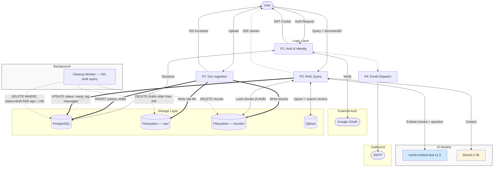
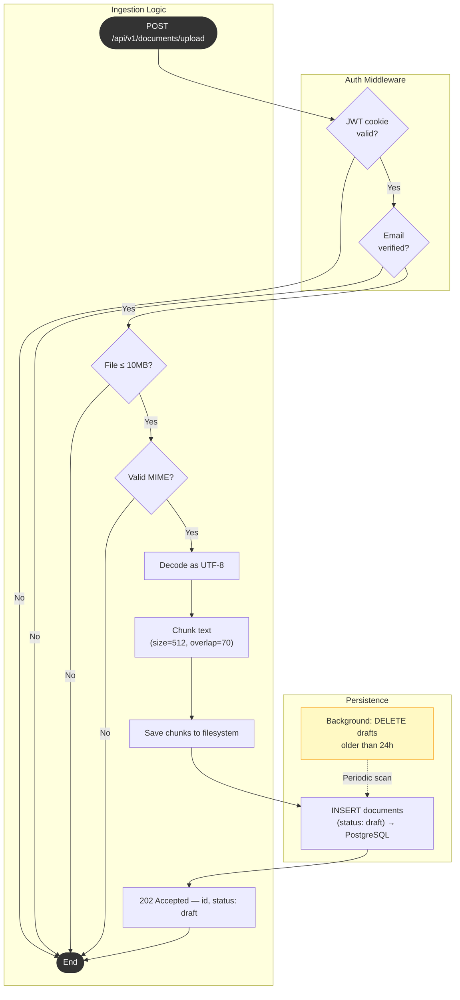
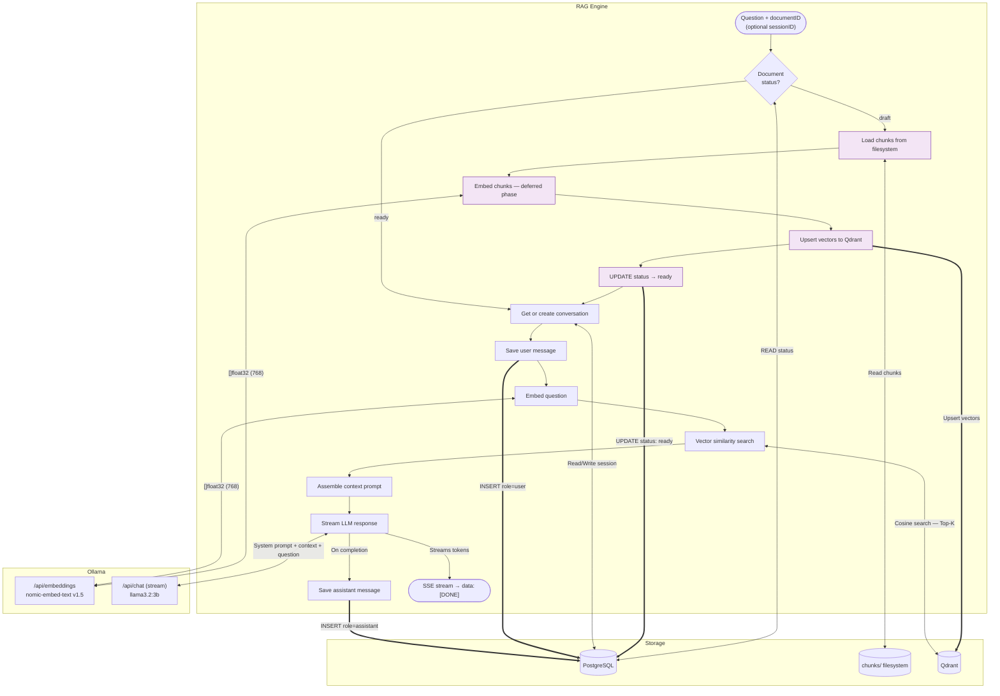

# Vai


<div align="center">


**[Documentation](#documentation--api-reference) · [Architecture](#architecture) · [Getting Started](#getting-started) · [Modules](#project-structure--modules) · [Contributing](#contributing)**

</div>

> Self-hosted, privacy-first AI document assistant — no cloud APIs, no data leaves your machine.
---
Vai is a fully self-hosted RAG (Retrieval-Augmented Generation) system built with Go. Upload documents, ask questions in plain language, and get answers grounded entirely in your own content — powered by [Ollama](https://ollama.com/) and [Qdrant](https://qdrant.tech/).

---

## Table of Contents

- [Why Vai](#why-vai)
- [Architecture](#architecture)
- [How It Works](#how-it-works)
- [Tech Stack](#tech-stack)
- [Project Structure & Modules](#project-structure--modules)
- [Getting Started](#getting-started)
- [Configuration](#configuration)
- [Documentation & API Reference](#documentation--api-reference)

---

## Why Vai

Most AI assistants send your data to third-party servers. Vai is different — every component runs locally: the language model, the embedding model, and the vector database. No external API calls, no per-query fees, no risk of sensitive documents leaving your environment.

---

## Architecture

Vai is a **Go modular monolith** with four processing engines, a React frontend, and three storage backends.



---

## How It Works

Vai separates document processing into two decoupled workflows: **ingestion** (synchronous, fast) and **embedding** (deferred to first query). This keeps upload latency low while still delivering full RAG capability.

---

### Document Ingestion (P2)

The upload endpoint validates, decodes, and chunks the document but deliberately skips embedding. Embedding is deferred to the first query.



**Steps:**

1. JWT cookie and email-verification guards run in middleware before any business logic.
2. File size (≤ 10 MB) and MIME type are validated.
3. Raw bytes are decoded as UTF-8 text.
4. Text is split into overlapping chunks (512 chars, 70-char overlap, boundary-aware).
5. Chunks are written to the `uploads/chunks/` directory.
6. A record is inserted into PostgreSQL with `status: draft`.
7. `202 Accepted` is returned immediately with a `documentID`.

Embedding and vector storage are **not** performed at this stage.

---

### RAG Query Engine (P3)

The query engine handles the full RAG pipeline. If the referenced document is still `draft`, the deferred embedding phase runs first.



**Deferred embedding** (runs only when `status = draft`):

| Step | Action |
|---|---|
| P3.0A | Load chunk files from `uploads/chunks/` |
| P3.0B | Send each chunk to Ollama `/api/embeddings` → `[]float32` (768 dims) |
| P3.0C | Upsert all vectors into Qdrant with document metadata |
| P3.0D | Update `status → ready` and record `chunk_count` in PostgreSQL |

**RAG phase** (always runs):

| Step | Action |
|---|---|
| P3.1 | Get or create a conversation for this user + document |
| P3.2 | Persist the user's message (`role=user`) |
| P3.3 | Embed the question → `[]float32` (768 dims) |
| P3.4 | Cosine similarity search in Qdrant — returns Top-K chunks |
| P3.5 | Assemble system prompt + retrieved context + question |
| P3.6 | Stream LLM response via Ollama `/api/chat` over SSE |
| P3.7 | On stream completion, persist the assistant's reply (`role=assistant`) |

---

### Auth & Identity (P1)

Authentication uses **Google OAuth 2.0**. On successful login, Vai issues a signed **JWT stored in an `HttpOnly` cookie** (`access_token`, 90-day expiry, `SameSite=Lax`). The token is read from the cookie automatically on every request — no `Authorization` header is required.

Email verification is enforced as a second gate in middleware before any document or chat endpoint is reached.

P1 also triggers **P4 (Email Dispatch)** for transactional emails via SMTP.

---

### Background Cleanup

A background worker runs on a 24-hour cycle to delete stale draft documents — uploads that were ingested but never queried.

| Resource | Action |
|---|---|
| `uploads/raw/` | Delete raw uploaded file |
| `uploads/chunks/` | Delete all chunk files |
| PostgreSQL | Delete records where `status = draft AND age > 24h` |

---

## Tech Stack

| Component | Technology |
|---|---|
| Frontend | React 19, Vite 7, Tailwind CSS 4 |
| Backend | Go 1.26+ |
| LLM | Ollama + llama3.2:3b |
| Embeddings | Ollama + nomic-embed-text v1.5 (768 dims) |
| Vector DB | Qdrant |
| Database | PostgreSQL 16 |
| Auth | Google OAuth 2.0 + JWT (HttpOnly cookie) |
| Email | SMTP (Gmail) |
| Deployment | Docker + Docker Compose |

---

## Project Structure & Modules

```
vai/
├── server/
│   ├── cmd/                    # Entry point (main.go)
│   └── internal/
│       ├── modules/
│       │   ├── auth/           # P1: OAuth, JWT cookie, session management
│       │   ├── chat/           # P3: RAG query engine, SSE streaming
│       │   ├── documents/      # P2: Upload, chunking, draft lifecycle
│       │   └── users/          # User profile, email verification
│       ├── rag-engine/         # Core RAG pipeline (embedder, retriever, generator)
│       └── server/             # HTTP router, middleware, bootstrap
└── web/
    └── src/
        ├── components/         # UI components (Radix UI / shadcn)
        ├── hooks/              # Custom React hooks
        ├── pages/              # Chat, documents, login
        └── services/           # API client, SSE handling
```

---

## Getting Started

### Prerequisites

- [Docker](https://docs.docker.com/get-docker/) and Docker Compose
- [Go 1.22+](https://go.dev/dl/) for local development
- [Ollama](https://ollama.com/) installed and running
- A Google OAuth 2.0 application (client ID + secret)

### Option A — Docker Compose (recommended)

```bash
git clone https://github.com/yourname/vai.git
cd vai
docker compose up
```

All services start together: PostgreSQL, Qdrant, Ollama, the Go server, and the React frontend. Available at `http://localhost:3000`.

---

### Option B — Local Development

**1. Start PostgreSQL**

```bash
docker run -p 5432:5432 \
  -e POSTGRES_USER=postgres \
  -e POSTGRES_PASSWORD=password \
  -e POSTGRES_DB=vai_db \
  postgres:16
```

**2. Start Qdrant**

```bash
docker run -p 6334:6334 qdrant/qdrant
```

**3. Start Ollama and pull models**

```bash
ollama serve

# In a separate terminal:
ollama pull llama3.2:3b
ollama pull nomic-embed-text:v1.5
```

**4. Start the server**

```bash
# With live reload (recommended)
air

# Or directly
go run ./cmd/...
```

Available at `http://localhost:3000`.

---

## Configuration

All configuration is provided via environment variables. Copy `.envrc.example` to `.envrc` and fill in the required values.

| Variable | Default | Description |
|---|---|---|
| `ENV` | `development` | Runtime environment |
| `ADDR` | `:3000` | Server listen address |
| `FRONTEND_URL` | `http://localhost:5173` | Frontend origin (for CORS) |
| `DB_ADDR` | — | PostgreSQL connection string |
| `DB_MAX_OPEN_CONNS` | `30` | Max open DB connections |
| `DB_MAX_IDLE_CONNS` | `30` | Max idle DB connections |
| `DB_MAX_IDLE_TIME` | `15m` | Max idle connection lifetime |
| `RAG_AI_MODEL_URL` | `http://localhost:11434` | Ollama server address |
| `RAG_AI_MODEL_NAME` | `llama3.2:3b` | LLM for answer generation |
| `RAG_AI_MODEL_EMBEDDING_NAME` | `nomic-embed-text:v1.5` | Embedding model |
| `RAG_CHUNKER_CHUNK_SIZE` | `512` | Characters per chunk |
| `RAG_CHUNKER_OVERLAP_SIZE` | `70` | Overlap between chunks |
| `RAG_CHUNKER_RESPECT_BOUNDARIES` | `true` | Avoid splitting mid-sentence |
| `QDRANT_DB_HOST` | `localhost` | Qdrant host |
| `QDRANT_DB_PORT` | `6334` | Qdrant port |
| `AUTH_JWT_SECRET` | — | **Required.** JWT signing secret |
| `AUTH_JWT_ISSUER` | `VAI-API` | JWT issuer claim |
| `AUTH_JWT_AUDIENCE` | `USERS` | JWT audience claim |
| `GOOGLE_CLIENT_ID` | — | **Required.** Google OAuth client ID |
| `GOOGLE_CLIENT_SECRET` | — | **Required.** Google OAuth client secret |
| `MAIL_SMTP_HOST` | `smtp.gmail.com` | SMTP server host |
| `MAIL_SMTP_PORT` | `587` | SMTP server port |
| `MAIL_USER` | — | SMTP login username |
| `MAIL_PASSWORD` | — | SMTP login password |
| `MAIL_FROM_NAME` | `Vai` | Display name for outbound email |
| `FROM_ADDRESS` | — | From email address |
| `MAIL_SUPPORT_EMAIL` | `support@vai.local` | Support contact address |
| `UPLOAD_DIR` | `./uploads/raw` | Raw file storage path |
| `UPLOAD_CHUNKS_DIR` | `./uploads/chunks` | Chunk file storage path |

> `AUTH_JWT_SECRET`, `GOOGLE_CLIENT_ID`, and `GOOGLE_CLIENT_SECRET` are required to start. Never commit these to source control — use `.envrc` or a secrets manager.

---

## Documentation & API Reference

Authentication is handled automatically via the `access_token` **HttpOnly cookie** set on login. No `Authorization` header is needed. Email verification is enforced on all document and chat endpoints.

---

### Authentication

#### Initiate Google OAuth Login

```
GET /api/v1/auth/google/login
```

Redirects to Google's OAuth consent screen.

---

#### OAuth Callback

```
GET /api/v1/auth/google/callback?code=...
```

Completes the OAuth flow. On success, sets the `access_token` cookie and returns user info.

```json
{
  "user": {
    "id": "550e8400-e29b-41d4-a716-446655440000",
    "email": "user@example.com",
    "email_verified": true
  }
}
```

---

### Documents

#### Upload a Document

```
POST /api/v1/documents/upload
Content-Type: multipart/form-data
```

Accepts a plain-text UTF-8 file. Validates, chunks, and stores as `draft`. Embedding is deferred to first query.

```bash
curl -X POST http://localhost:3000/api/v1/documents/upload \
  -b "access_token=<token>" \
  -F "file=@/path/to/document.txt"
```

**Constraints:** max 10 MB, `text/plain` only, UTF-8 encoding.

**Response — `202 Accepted`**

```json
{
  "id": "550e8400-e29b-41d4-a716-446655440000",
  "name": "document.txt",
  "status": "draft",
  "chunk_count": null
}
```

> `chunk_count` is `null` until the document is first queried and embedding completes.

**Errors**

| Status | Reason |
|---|---|
| `401` | Missing or invalid JWT cookie |
| `403` | Email not verified |
| `413` | File exceeds 10 MB |
| `422` | Unsupported MIME type or encoding error |

---

#### List Documents

```
GET /api/v1/documents
```

Returns all documents for the authenticated user (Planned feature).

```json
[
  {
    "id": "550e8400-e29b-41d4-a716-446655440000",
    "name": "architecture.txt",
    "status": "ready",
    "chunk_count": 14,
    "created_at": "2026-04-01T10:00:00Z"
  }
]
```

---

#### Delete a Document (Planned)

```
DELETE /api/v1/documents/:id
```

Deletes the document record, raw file, chunk files, and all associated Qdrant vectors.

**Response — `204 No Content`**

---

### Conversations & RAG

#### Send a Message

```
POST /api/v1/conversations/:id
Content-Type: application/json
Accept: text/event-stream
```

Runs the full RAG pipeline and streams the response via **Server-Sent Events**. If the document is still `draft`, deferred embedding runs automatically first.

```bash
curl -X POST http://localhost:3000/api/v1/conversations/550e8400-e29b-41d4-a716-446655440000 \
  -b "access_token=<token>" \
  -H "Content-Type: application/json" \
  -H "Accept: text/event-stream" \
  -d '{
    "question": "How does the authentication flow work?",
    "top_k": 5
  }'
```

**Request Body**

| Field | Type | Required | Default | Description |
|---|---|---|---|---|
| `question` | string | yes | — | The question to answer |
| `top_k` | int | no | `5` | Chunks to retrieve from Qdrant |

**SSE Response**

```
data: Based
...
data: [DONE]
```

---

#### Get Conversation History

```
GET /api/v1/conversations/:id
```

```json
{
  "id": "550e8400-e29b-41d4-a716-446655440000",
  "document_id": "550e8400-e29b-41d4-a716-446655440000",
  "messages": [
    { "role": "user", "content": "How does auth work?", "created_at": "..." },
    { "role": "assistant", "content": "Based on the document...", "created_at": "..." }
  ]
}
```

---

#### List Conversations

```
GET /api/v1/conversations
```

Returns all sessions for the authenticated user, ordered by most recent.

---

## Contributing

1. Fork the repository and create a feature branch: `git checkout -b feature/your-feature`
2. Commit your changes: `git commit -m 'feat: your feature'`
3. Push and open a pull request against `main`

Please open an issue first for non-trivial changes, follow the existing code style, and include tests for new behavior.

---

## License

MIT — see [LICENSE](LICENSE) for details.