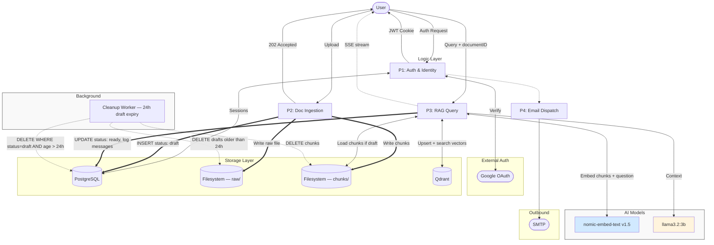
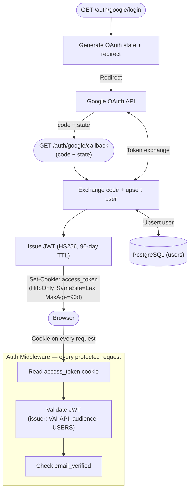
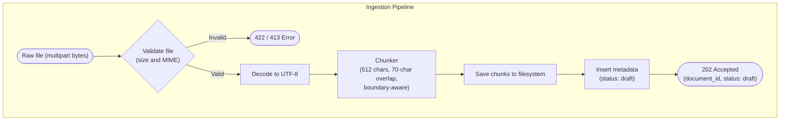

# Vai — High-Level Design Document

**Version:** 1.0  
**Date:** April 2026  
**Status:** Internal Reference

---

## Table of Contents

1. [Project Overview](#1-project-overview)
2. [Design Goals & Principles](#2-design-goals--principles)
3. [System Architecture](#3-system-architecture)
4. [Component Breakdown](#4-component-breakdown)
5. [Processing Engines](#5-processing-engines)
6. [Data Architecture](#6-data-architecture)
7. [Authentication & Security](#7-authentication--security)
8. [API Design](#8-api-design)
9. [Deployment & Infrastructure](#9-deployment--infrastructure)
10. [Configuration Reference](#10-configuration-reference)
11. [Non-Functional Characteristics](#11-non-functional-characteristics)
12. [Known Limitations & Future Work](#12-known-limitations--future-work)

---

## 1. Project Overview

Vai is a **self-hosted, privacy-first AI document assistant** built in Go. It enables users to upload plain-text documents and interact with them through a natural-language chat interface, with all processing — including language model inference, embeddings, and vector search — happening entirely on the local machine or within a private network.

Unlike cloud-based AI assistants, Vai makes a hard architectural guarantee: **no document content, queries, or user data ever leave the operator's environment.** There are no external API calls to AI providers, no per-query fees, and no risk of sensitive data leaking through a third-party service.

The system implements a standard **Retrieval-Augmented Generation (RAG)** pipeline: documents are chunked and embedded into a vector store, and at query time the most semantically relevant chunks are retrieved and injected into a structured prompt that is sent to a locally-running language model.

### Core Capabilities

- Upload plain-text documents (up to 10 MB) via a multipart form endpoint
- Ask natural-language questions about uploaded documents
- Receive streaming, token-by-token answers grounded in document content
- Maintain persistent conversation history per document
- Authenticate securely via Google OAuth 2.0 with JWT session management
- Automatically clean up stale, unused uploads via a background worker

---

## 2. Design Goals & Principles

### Privacy by Architecture
All AI inference — both embedding and generation — runs locally via [Ollama](https://ollama.com/). Vector storage runs via [Qdrant](https://qdrant.tech/) on the same host or private network. No user data crosses a trust boundary.

### Low Upload Latency via Deferred Embedding
Document embedding is intentionally **not** performed at upload time. The upload endpoint only validates, chunks, and records the document as `draft`, returning a `202 Accepted` immediately. Embedding is deferred to the first query. This keeps the upload path fast and lightweight regardless of document size.

### Single-Deployment Simplicity
Vai is packaged as a **Go modular monolith** backed by Docker Compose. A single `docker compose up` starts all five services (API, frontend, PostgreSQL, Qdrant, Ollama) with no external dependencies. This design prioritizes ease of self-hosting over horizontal scalability.

### Deterministic Document Lifecycle
Documents move through a strict, auditable status lifecycle (`draft → processing → ready / failed`). Every transition is recorded in PostgreSQL, making the system's state inspectable at any point without needing to query external systems.

### Minimal Surface Area
Vai has no email/password registration, no refresh token flow, no admin panel, and no plugin system. These omissions are deliberate — each adds attack surface and operational complexity without serving the core use case.

---

## 3. System Architecture

Vai is structured as a **Go modular monolith** with four internal processing engines, a React frontend, and three distinct storage backends (relational, vector, and filesystem). All services communicate over a private Docker bridge network; only the API and frontend ports are exposed to the host.

### High-Level Topology



### Docker Compose Service Map

| Service | Internal Port | Exposed to Host | Technology |
|---|---|---|---|
| `vai-web` | 5173 | Yes | Vite / React 19 |
| `vai-api` | 3000 | Yes | Go 1.26+ binary |
| `postgres` | 5432 | No (internal only) | PostgreSQL 16 |
| `qdrant` | 6334 | No (internal only) | Qdrant |
| `ollama` | 11434 | No (internal only) | Ollama LLM runtime |

All five services communicate over a private Docker bridge network (`vai_network`). PostgreSQL, Qdrant, and Ollama are intentionally unexposed to the host in production to reduce the attack surface.

---

## 4. Component Breakdown

### Frontend — React / Vite

The frontend is a single-page application built with React 19 and Vite 7, styled with Tailwind CSS 4. It communicates with the API exclusively over REST and Server-Sent Events (SSE). There is no direct browser-to-database or browser-to-model connection.

Key UI responsibilities:
- Google OAuth login redirect and callback handling
- Document upload form with status polling
- Chat interface with real-time SSE token streaming
- Conversation history display

### Backend API — Go Monolith

The API is a single Go binary exposing an HTTP server on `:3000`. Internally it is organized into four processing engines (described in Section 5). It uses `pgx/v5` for PostgreSQL, plain HTTP clients for Ollama and Qdrant, and the standard library's `net/http` for SSE streaming.

The binary also hosts the background cleanup worker as a goroutine — there is no separate process.

### AI Runtime — Ollama

Ollama runs two models:

| Model | Role | Output |
|---|---|---|
| `nomic-embed-text:v1.5` | Text embedding | `[]float32` — 768 dimensions |
| `llama3.2:3b` | Answer generation | Token stream |

The API communicates with Ollama over its REST interface (`/api/embeddings` and `/api/chat`). No SDKs are used; all calls are plain HTTP.

### Vector Store — Qdrant

Qdrant stores document chunk embeddings as 768-dimensional float32 vectors with cosine distance. Each vector point carries a payload with metadata (document ID, chunk index, original text) enabling filtered similarity search per document.

### Relational Store — PostgreSQL 16

PostgreSQL is the primary source of truth for all relational data: user accounts, document records (including status), chat sessions, and message history. Schema migrations are applied at startup.

---

## 5. Processing Engines

### P1: Auth & Identity

Handles the full Google OAuth 2.0 login flow and issues JWT session tokens. There is no username/password path.

**Flow:**
1. `GET /auth/google/login` — generates an OAuth state parameter, stores it in a short-lived cookie, and redirects the browser to Google's consent screen.
2. `GET /auth/google/callback` — receives the authorization code and state, validates the state, exchanges the code for a Google ID token, validates the token, and upserts the user record in PostgreSQL.
3. A signed HS256 JWT is issued with a 90-day TTL and set as an `HttpOnly`, `SameSite=Lax` cookie named `access_token`.
4. All subsequent protected requests are authenticated by reading this cookie in middleware. No `Authorization` header is required.
5. A second middleware gate checks `email_verified` from the JWT before allowing access to document or chat endpoints.

P1 also triggers P4 (Email Dispatch) to send welcome and authentication notification emails via SMTP.



---

### P2: Document Ingestion

Handles file upload, validation, chunking, and filesystem persistence. Embedding is **deliberately excluded** from this engine — it happens lazily in P3 on first query.

**Flow:**
1. Auth middleware validates the JWT cookie and email verification.
2. File size is checked against the 10 MB limit.
3. MIME type must be `text/plain`.
4. Raw bytes are decoded as UTF-8.
5. The text is split into overlapping chunks: 512 characters per chunk, 70-character overlap, boundary-aware (avoids splitting mid-word or mid-sentence where possible).
6. Raw file is written to `uploads/raw/`.
7. Chunk files are written to `uploads/chunks/`.
8. A document record is inserted into PostgreSQL with `status: draft` and `chunk_count: null`.
9. `202 Accepted` is returned with the new `document_id`.



---

### P3: RAG Query Engine

The core engine. Handles deferred embedding (if the document is still `draft`), vector similarity search, prompt assembly, LLM streaming, and message persistence.

**Deferred Embedding Phase** (runs only when `status = draft` or `processing`):

| Step | Action |
|---|---|
| P3.0A | Load chunk files from `uploads/chunks/` |
| P3.0B | Send each chunk to Ollama `/api/embeddings` (nomic-embed-text v1.5) → `[]float32` (768 dims) |
| P3.0C | Upsert all vector points into Qdrant with document metadata payload |
| P3.0D | Update PostgreSQL: `status → ready`, `chunk_count = N` |

**RAG Phase** (always runs):

| Step | Action |
|---|---|
| P3.1 | Get or create a chat session for this user + document pair |
| P3.2 | Persist the incoming user message (`role=user`) to PostgreSQL |
| P3.3 | Embed the user's question → `[]float32` (768 dims) |
| P3.4 | Cosine similarity search in Qdrant, filtered by document ID → Top-K chunks |
| P3.5 | Assemble prompt: system instructions + retrieved chunk text as context + user question |
| P3.6 | Stream LLM response from Ollama `/api/chat` (llama3.2:3b) over SSE |
| P3.7 | On stream completion, persist the assistant's full reply (`role=assistant`) |

```mermaid
flowchart TD
    subgraph App [RAG Engine]
        Start(["User question + documentID"])
        P3_0{"Document status?"}
        P3_0A["Load chunks from filesystem"]
        P3_0B["Embed chunks (deferred)"]
        P3_0C["Upsert vectors to Qdrant"]
        P3_0D["UPDATE status → ready"]
        P3_1["Get or create session"]
        P3_2["Save user message"]
        P3_3["Embed question"]
        P3_4["Vector similarity search"]
        P3_5["Assemble context prompt"]
        P3_6["Stream LLM response"]
        P3_7["Save assistant message"]
        End(["SSE stream → data: [DONE]"])
    end

    Start --> P3_0
    P3_0 -->|"draft"| P3_0A --> P3_0B --> P3_0C --> P3_0D --> P3_1
    P3_0 -->|"ready"| P3_1
    P3_1 --> P3_2 --> P3_3 --> P3_4 --> P3_5 --> P3_6
    P3_6 -->|"Streams tokens"| End
    P3_6 -->|"On completion"| P3_7

    classDef deferred fill:#f3e5f5,stroke:#6a1b9a
    class P3_0A,P3_0B,P3_0C,P3_0D deferred
```



---

### P4: Email Dispatch

A lightweight outbound email engine. It is triggered by P1 for transactional messages (welcome emails, auth notifications). It communicates with the configured SMTP server over port 587 (STARTTLS). It has no inbound capability and does not implement any retry queue — delivery failures are logged but do not block the auth flow.

---

### Background Cleanup Worker

A goroutine running inside the API binary on a 24-hour cycle. It finds all document records with `status = draft` older than 24 hours — uploads that were ingested but never queried and therefore never embedded — and permanently deletes them.

| Resource | Action |
|---|---|
| `uploads/raw/<document_id>` | Delete raw uploaded file from filesystem |
| `uploads/chunks/<document_id>/` | Delete all chunk files from filesystem |
| PostgreSQL `documents` table | `DELETE WHERE status = 'draft' AND created_at < NOW() - INTERVAL '24h'` |

Note: documents in `ready` status (i.e., already embedded and stored in Qdrant) are **not** touched by this worker. User-initiated deletion is a planned feature handled via the `DELETE /api/v1/documents/:id` endpoint.

---

## 6. Data Architecture

### Storage Backends

| Store | Technology | Purpose |
|---|---|---|
| D1: Relational | PostgreSQL 16 | Users, documents, sessions, messages |
| D2: Vector | Qdrant | 768-dim chunk embeddings for cosine similarity search |
| D3a: Embedding Model | Ollama (nomic-embed-text v1.5) | Produces `[]float32` vectors from text |
| D3b: Generation Model | Ollama (llama3.2:3b) | Generates streamed natural-language answers |
| D4a: Raw Files | Filesystem (`uploads/raw/`) | Original uploaded file bytes |
| D4b: Chunk Files | Filesystem (`uploads/chunks/`) | Chunked text, deleted after embedding or after 24h expiry |
| D5: Session Token | HttpOnly cookie | Signed JWT, stored on the client |

### Document Status Lifecycle

Documents move linearly through the following states:

```
draft  →  processing  →  ready
                      ↘  failed
```

| Status | Set By | Meaning |
|---|---|---|
| `draft` | Upload handler (P2.5) | File saved, chunks on disk, not yet embedded |
| `processing` | RAG engine (P3.0) | Deferred embedding phase in progress |
| `ready` | RAG engine (P3.0D) | Fully embedded, searchable in Qdrant |
| `failed` | RAG engine (P3.0) | Embedding failed; eligible for retry |

The status field in PostgreSQL is the single source of truth. Qdrant is a derived store — if it is wiped, documents can be re-embedded by resetting their status to `draft`.

### Key Data Flows

**Upload path (synchronous):**
```
Multipart bytes → Chunker → Filesystem (chunks/) → PostgreSQL (status: draft) → 202 Response
```

**First-query embedding (lazy, deferred):**
```
Filesystem (chunks/) → Ollama /api/embeddings → Qdrant (upsert) → PostgreSQL (status: ready)
```

**Query path (every query after embedding):**
```
Question → Ollama /api/embeddings → Qdrant (cosine search) → Prompt assembly → Ollama /api/chat → SSE stream → PostgreSQL (message log)
```

### Data Classification

| Data Element | Classification | Storage | Retention Policy |
|---|---|---|---|
| User email | PII | PostgreSQL (plaintext) | Until account deletion |
| Google OAuth tokens | Sensitive | PostgreSQL | Until expired or revoked |
| Document text (raw) | Confidential | Filesystem `raw/` | Until user-initiated deletion |
| Document chunks | Confidential | Filesystem `chunks/` | Deleted on embedding completion or after 24h |
| Vector embeddings | Confidential | Qdrant | Until document deletion |
| Chat messages | Confidential | PostgreSQL | Until session or account deletion |
| JWT access token | Internal | HttpOnly cookie (HS256) | 90-day TTL |

---

## 7. Authentication & Security

### Authentication Model

Vai uses **Google OAuth 2.0 exclusively**. There is no username/password path, no self-registration, no refresh token, and no password reset flow. This reduces the authentication attack surface to the OAuth callback and JWT validation.

### JWT Token Characteristics

| Property | Value |
|---|---|
| Algorithm | HS256 |
| TTL | 90 days |
| Delivery | HttpOnly cookie (`access_token`) |
| SameSite | Lax |
| Issuer claim | `vai-server` |
| Audience claim | `users` |

Tokens are stateless — there is no server-side session store. Invalidation is achieved by removing or overwriting the cookie. Because there is no refresh token, a user must re-authenticate via Google after 90 days.

### Auth Middleware Gates

Every protected route passes through two sequential middleware checks:

1. **JWT validation** — reads `access_token` cookie, verifies signature, issuer, and audience.
2. **Email verification** — checks the `email_verified` claim. Unverified Google accounts cannot access document or chat endpoints.

### Network Security

In production, all inbound traffic is expected to terminate at an Nginx or Caddy reverse proxy with TLS. The PostgreSQL, Qdrant, and Ollama ports are bound to the internal Docker network only and are not reachable from the host or the internet. SMTP and Google OAuth are the only outbound connections.

```
Internet → HTTPS :443 → Nginx/Caddy → vai-api :3000
                                    → PostgreSQL :5432 (internal)
                                    → Qdrant :6334 (internal)
                                    → Ollama :11434 (internal)
vai-api → SMTP :587 (outbound)
vai-api → Google OAuth :443 (outbound)
```

---

## 8. API Design

The API follows REST conventions. All endpoints are prefixed with `/api/v1/`. Authentication is cookie-based — no `Authorization` header is needed.

### Authentication Endpoints

| Method | Path | Description |
|---|---|---|
| `GET` | `/api/v1/auth/google/login` | Initiate OAuth flow — redirects to Google |
| `GET` | `/api/v1/auth/google/callback` | OAuth callback — exchanges code, sets JWT cookie |

### Document Endpoints

| Method | Path | Description |
|---|---|---|
| `POST` | `/api/v1/documents/upload` | Upload a document (`multipart/form-data`) |
| `GET` | `/api/v1/documents` | List all documents for the authenticated user |
| `DELETE` | `/api/v1/documents/:id` | Delete document, files, and vectors (planned) |

**Upload constraints:** max 10 MB, `text/plain` MIME type, UTF-8 encoding required.

**Upload response — `202 Accepted`:**
```json
{
  "id": "550e8400-e29b-41d4-a716-446655440000",
  "name": "document.txt",
  "status": "draft",
  "chunk_count": null
}
```

`chunk_count` is `null` until deferred embedding completes on first query.

**Upload error codes:**

| Status | Reason |
|---|---|
| `401` | Missing or invalid JWT cookie |
| `403` | Email not verified |
| `413` | File exceeds 10 MB |
| `422` | Unsupported MIME type or encoding error |

### Conversation & RAG Endpoints

| Method | Path | Description |
|---|---|---|
| `POST` | `/api/v1/conversations/:id` | Send a question — returns SSE stream |
| `GET` | `/api/v1/conversations/:id` | Retrieve conversation history |
| `GET` | `/api/v1/conversations` | List all conversations for the authenticated user |

**Query request body:**
```json
{
  "question": "How does the authentication flow work?",
  "top_k": 5
}
```

`top_k` controls how many chunks Qdrant returns for context assembly (default: 5).

**SSE response format:**
```
data: Based
data:  on
data:  the
...
data: [DONE]
```

Tokens are streamed as they are produced by the LLM. The client closes the event stream connection after receiving `[DONE]`.

---

## 9. Deployment & Infrastructure

### Development

```bash
git clone https://github.com/yourname/vai.git
cd vai
docker compose up
```

All five services start together. The Go API supports live-reload via [Air](https://github.com/cosmtrek/air). The React frontend is served by Vite's dev server on `:5173`. The API is available on `:3000`.

For local-only development without Docker, each service can be started individually:
- PostgreSQL via `docker run`
- Qdrant via `docker run`
- Ollama via `ollama serve` with `ollama pull llama3.2:3b` and `ollama pull nomic-embed-text:v1.5`
- API via `air` or `go run ./cmd/...`

### Production

Production deployments use Nginx (or Caddy) as a TLS-terminating reverse proxy in front of the API. All backing services remain in the Docker network with no host port exposure. Volume-backed storage is used for PostgreSQL data, Qdrant indexes, and Ollama model weights to survive container restarts.

If a GPU is available on the host, Ollama will use it automatically for faster inference. CPU-only inference is supported but significantly slower for generation.

### Environment Summary

| Environment | Services | Notes |
|---|---|---|
| Development | All via Docker Compose | Hot-reload, local ports exposed |
| Staging | All via Docker Compose | Mirrors production, SMTP sandbox |
| Production | Nginx + Docker Compose | TLS, internal-only backing services |
| Future (v1.3+) | Kubernetes + Helm | HPA, managed PostgreSQL |

---

## 10. Configuration Reference

All configuration is provided via environment variables. The following are required at startup: `AUTH_JWT_SECRET`, `GOOGLE_CLIENT_ID`, `GOOGLE_CLIENT_SECRET`.

| Variable | Default | Description |
|---|---|---|
| `ENV` | `development` | Runtime environment |
| `ADDR` | `:3000` | Server listen address |
| `FRONTEND_URL` | `http://localhost:5173` | Frontend origin (for CORS) |
| `DB_ADDR` | — | PostgreSQL connection string |
| `DB_MAX_OPEN_CONNS` | `30` | Max open DB connections |
| `DB_MAX_IDLE_CONNS` | `30` | Max idle DB connections |
| `DB_MAX_IDLE_TIME` | `15m` | Max idle connection lifetime |
| `RAG_AI_MODEL_URL` | `http://localhost:11434` | Ollama server address |
| `RAG_AI_MODEL_NAME` | `llama3.2:3b` | LLM for answer generation |
| `RAG_AI_MODEL_EMBEDDING_NAME` | `nomic-embed-text:v1.5` | Embedding model |
| `RAG_CHUNKER_CHUNK_SIZE` | `512` | Characters per chunk |
| `RAG_CHUNKER_OVERLAP_SIZE` | `70` | Overlap between chunks in characters |
| `RAG_CHUNKER_RESPECT_BOUNDARIES` | `true` | Avoid splitting mid-sentence |
| `QDRANT_DB_HOST` | `localhost` | Qdrant host |
| `QDRANT_DB_PORT` | `6334` | Qdrant port |
| `AUTH_JWT_SECRET` | **required** | JWT signing secret (HS256) |
| `AUTH_JWT_ISSUER` | `vai-server` | JWT issuer claim |
| `AUTH_JWT_AUDIENCE` | `users` | JWT audience claim |
| `GOOGLE_CLIENT_ID` | **required** | Google OAuth client ID |
| `GOOGLE_CLIENT_SECRET` | **required** | Google OAuth client secret |
| `MAIL_SMTP_HOST` | `smtp.gmail.com` | SMTP server host |
| `MAIL_SMTP_PORT` | `587` | SMTP server port |
| `MAIL_USER` | — | SMTP login username |
| `MAIL_PASSWORD` | — | SMTP login password |
| `MAIL_FROM_NAME` | `Vai` | Display name for outbound email |
| `FROM_ADDRESS` | — | From email address |
| `MAIL_SUPPORT_EMAIL` | `support@vai.local` | Support contact address |
| `UPLOAD_DIR` | `./uploads/raw` | Raw file storage path |
| `UPLOAD_CHUNKS_DIR` | `./uploads/chunks` | Chunk file storage path |

> Never commit `AUTH_JWT_SECRET`, `GOOGLE_CLIENT_ID`, or `GOOGLE_CLIENT_SECRET` to source control. Use `.envrc` or a secrets manager.

---

## 11. Non-Functional Characteristics

### Performance

Upload latency is bounded by file I/O and chunking — not embedding — because embedding is deferred. For a typical 1 MB text file with ~2,000 chunks, the upload handler returns in under 100 ms on a standard VM.

First-query latency is higher due to the deferred embedding phase. With `nomic-embed-text v1.5` on CPU, embedding ~2,000 chunks takes approximately 10–60 seconds depending on hardware. Subsequent queries skip this step entirely.

Generation latency depends heavily on hardware. With `llama3.2:3b` on CPU, time-to-first-token is typically 2–15 seconds. GPU-equipped hosts will be substantially faster.

### Scalability

Vai is designed for single-user or small-team self-hosted use. The modular monolith architecture does not support horizontal scaling of individual engines. Scaling the entire stack requires running multiple instances behind a load balancer, which is not supported in the current Compose configuration.

The v1.3+ roadmap targets a Kubernetes deployment with Helm, horizontal pod autoscaling, and a managed PostgreSQL instance.

### Reliability

- PostgreSQL is the primary durability guarantee. All document status, message history, and user data are written there before responding to the client.
- Qdrant is a derived store. If it is corrupted or wiped, documents can be re-embedded by resetting their status to `draft` in PostgreSQL.
- Filesystem chunk files are transient by design. They are safe to delete after `status = ready`. The cleanup worker enforces this automatically for stale drafts.
- The background cleanup goroutine runs inside the API process. If the API crashes, cleanup resumes on restart.

### Observability

- Errors and significant events are logged to stdout in structured format.
- There is no built-in metrics endpoint or distributed tracing in the current version.
- Database query errors, Ollama call failures, and Qdrant errors are logged with context but do not have automated alerting.

---

## 12. Known Limitations & Future Work

### Current Limitations

- **Text-only ingestion.** Only `text/plain` UTF-8 files are supported. PDF, DOCX, and other formats are not handled.
- **No document deletion in v1.0.** The `DELETE /api/v1/documents/:id` endpoint is planned but not implemented. Qdrant vectors for deleted documents accumulate until manual cleanup.
- **No refresh token.** Users must re-authenticate via Google every 90 days. There is no silent re-authentication.
- **Single-model configuration.** The embedding and generation models are fixed via environment variable. There is no per-request or per-user model selection.
- **CPU-bound embedding at scale.** Embedding large documents on CPU is slow. There is no batching optimization or parallel embedding pipeline in the current implementation.
- **No retry queue for email.** SMTP failures in P4 are logged but not retried.
- **No admin interface.** There is no management UI for viewing all users, documents, or system health.

### Planned Work (v1.1 – v1.3)

| Feature | Target Version |
|---|---|
| Document deletion (files + Qdrant vectors) | v1.1 |
| PDF and DOCX ingestion support | v1.1 |
| Document list endpoint with pagination | v1.1 |
| Embedding retry on `failed` status | v1.2 |
| Metrics endpoint (Prometheus-compatible) | v1.2 |
| Kubernetes Helm chart with HPA | v1.3 |
| Managed PostgreSQL support | v1.3 |
| Multi-model selection per user | v1.3+ |

---

*This document is maintained alongside the source code. For the authoritative data flow diagrams, see `DFD.md`. For the deployment topology diagrams, see `Architecture_Diagram.md`.*