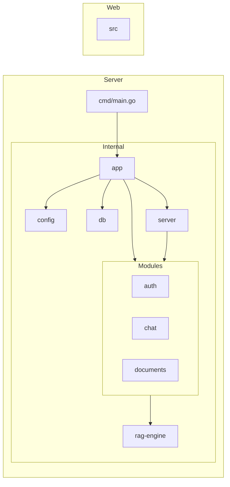

# Low-Level Design (LLD)

## Vai — Privacy-First AI Document Assistant

**Version:** 1.0  
**Date:** April 2026  
**Author:** Lead Software Architect

---

## Table of Contents

1. [Package Structure](#package-structure)
2. [Data Models](#data-models)
3. [Service Interfaces](#service-interfaces)
4. [Key Algorithms](#key-algorithms)
5. [Middleware Design](#middleware-design)
6. [Error Handling Strategy](#error-handling-strategy)
7. [Database Access Layer](#database-access-layer)
8. [Configuration](#configuration)

---

## Package Structure



---

## Data Models

### User

```go
type User struct {
    ID        uuid.UUID `db:"id" json:"id"`
    FirstName string    `db:"first_name" json:"first_name"`
    LastName  string    `db:"last_name" json:"last_name"`
    Email     string    `db:"email" json:"email"`
    Password  Password  `db:"-" json:"-"`
    IsActive  bool      `db:"is_active" json:"is_active"`
    CreatedAt time.Time `db:"created_at" json:"created_at"`
}

type Password struct {
    Hash []byte `db:"password"`
    Text *string
}

type OAuthAccount struct {
    ID             uuid.UUID  `db:"id"`
    UserID         uuid.UUID  `db:"user_id"`
    Provider       string     `db:"provider"`
    ProviderUserID string     `db:"provider_user_id"`
    CreatedAt      time.Time  `db:"created_at"`
}
```

### Tokens

```go
// models/token.go

type VerificationToken struct {
    ID        uuid.UUID `db:"id"`
    UserID    uuid.UUID `db:"user_id"`
    TokenHash string    `db:"token_hash"` // HMAC-SHA256 hex
    ExpiresAt time.Time `db:"expires_at"` // 24 hours
    Used      bool      `db:"used"`
    CreatedAt time.Time `db:"created_at"`
}

type PasswordResetToken struct {
    ID        uuid.UUID `db:"id"`
    UserID    uuid.UUID `db:"user_id"`
    TokenHash string    `db:"token_hash"`
    ExpiresAt time.Time `db:"expires_at"` // 1 hour
    Used      bool      `db:"used"`
    CreatedAt time.Time `db:"created_at"`
}
```

### Document

```go
// internal/modules/documents/model.go

type Document struct {
    ID           uuid.UUID `json:"id"`
    OwnerID      uuid.UUID `json:"owner_id"`
    Name         string    `json:"name"`
    OriginalName string    `json:"original_name"`
    Size         int64     `json:"size"`
    MimeType     string    `json:"mime_type"`
    Status       string    `json:"status"` // "draft", "processing", "ready", "failed"
    CreatedAt    time.Time `json:"created_at"`
    UpdatedAt    time.Time `json:"updated_at"`
}

type DocumentChunk struct {
    Text      string `json:"Text"`
    Index     int    `json:"Index"`
    StartChar int    `json:"StartChar"`
    EndChar   int    `json:"EndChar"`
}
```


### Conversation

```go
// internal/modules/chat/model.go

type Conversation struct {
    ID         uuid.UUID  `json:"id"`
    UserID     uuid.UUID  `json:"user_id"`
    Title      string     `json:"title"`
    DocumentID *uuid.UUID `json:"document_id"`
    CreatedAt  time.Time  `json:"created_at"`
    UpdatedAt  time.Time  `json:"updated_at"`
}

type Message struct {
    ID             uuid.UUID `json:"id"`
    ConversationID uuid.UUID `json:"conversation_id"`
    Role           string    `json:"role"`
    Content        string    `json:"content"`
    CreatedAt      time.Time `json:"created_at"`
}
```

### JWT Claims

```go
type JWTClaims struct {
    UserID    string `json:"sub"`
    Email     string `json:"email"`
    jwt.RegisteredClaims
}

// Access token: HS256, 90-day TTL
```

---

## Service Interfaces

```go
type AuthService interface {
    Register(ctx context.Context, payload RegisterPayload) (*models.User, error)
    Login(ctx context.Context, payload AuthenticatePayload) (string, error)
    Logout(ctx context.Context) error
    VerifyEmail(ctx context.Context, token string) error
    OAuthLogin(ctx context.Context, provider, code string) (string, error)
}

type RegisterPayload struct {
    FirstName string `json:"first_name"`
    LastName  string `json:"last_name"`
    Email     string `json:"email"`
    Password  string `json:"password"`
}
```

### UserService

```go
// services/user/user.go

type UserService interface {
    GetByID(ctx context.Context, userID uuid.UUID) (*models.User, error)
    Update(ctx context.Context, userID uuid.UUID, req UpdateUserRequest) (*models.User, error)
    Delete(ctx context.Context, userID uuid.UUID) error
}

type UpdateUserRequest struct {
    FirstName   string  `json:"first_name"`
    LastName    string  `json:"last_name"`
    AvatarURL   *string `json:"avatar_url"`
}
```

```go
type ConversationService interface {
    Create(ctx context.Context, userID uuid.UUID, payload StartConversationDTO) (*models.Conversation, error)
    List(ctx context.Context, userID uuid.UUID) ([]models.Conversation, error)
    Get(ctx context.Context, userID, id uuid.UUID) (*models.Conversation, error)
    Delete(ctx context.Context, userID, id uuid.UUID) error
    AddMessage(ctx context.Context, conversationID uuid.UUID, payload SendMessageDTO) (*models.Message, error)
}
```

### EmailService

```go
// services/email/email.go

type EmailService interface {
    SendVerification(ctx context.Context, to, displayName, token string) error
    SendPasswordReset(ctx context.Context, to, displayName, token string) error
    SendWelcome(ctx context.Context, to, displayName string) error
}
```

```go
type RAGPipeline interface {
    Ingest(ctx context.Context, documentID uuid.UUID, text string) error
    Search(ctx context.Context, userID uuid.UUID, query string, topK int, documentID *uuid.UUID) ([]SearchResult, error)
    StreamAnswer(ctx context.Context, userID uuid.UUID, conversationID uuid.UUID, question string, w io.Writer) error
}

type SearchResult struct {
    DocumentID uuid.UUID `json:"document_id"`
    ChunkText  string    `json:"text"`
    Score      float64   `json:"score"`
}
```

### Chunker

```go
// chunker/chunker.go

type Chunk struct {
    Text       string
    Index      int
    StartChar  int
    EndChar    int
}

type Chunker struct {
    ChunkSize    int // default: 500
    ChunkOverlap int // default: 100
}

func (c *Chunker) Split(text string) []Chunk
```

### Embedding Client

```go
// embeddings/embeddings.go

type EmbeddingClient interface {
    Embed(ctx context.Context, text string) ([]float32, error)
}

type OllamaEmbeddingClient struct {
    BaseURL string
    Model   string // "nomic-embed-text:v1.5"
    Client  *http.Client
}
```

### Qdrant Client

```go
// vectorstore/qdrant.go

type VectorStore interface {
    EnsureCollection(ctx context.Context, collection string, vectorSize int) error
    Upsert(ctx context.Context, collection string, points []Point) error
    Search(ctx context.Context, collection string, vector []float32, topK int, filter *Filter) ([]SearchResult, error)
    DeleteByFilter(ctx context.Context, collection string, filter Filter) error
    DeleteCollection(ctx context.Context, collection string) error
}

type Point struct {
    ID      string
    Vector  []float32
    Payload map[string]interface{}
}

type Filter struct {
    Must []Condition
}

type Condition struct {
    Key   string
    Value interface{}
}
```

---

## Key Algorithms

### Chunker Algorithm

```
function Split(text, chunkSize, overlap):
    chunks = []
    splitter = go_chunker.NewSplitter(size=chunkSize, overlap=overlap)
    contentChunks = splitter.Split(text)
    return contentChunks
```

**Note:** The system utilizes `github.com/ABDELRAHMAN-ELRAYES/go-chunker` for standardized, overlap-aware text splitting.


**Example:** text of 1200 chars, size=500, overlap=100:

- Chunk 0: chars 0–500
- Chunk 1: chars 400–900
- Chunk 2: chars 800–1200

### Qdrant Point ID Generation

```go
// Deterministic UUID from document ID + chunk index
// Ensures re-ingestion overwrites existing vectors (upsert semantics)
func pointID(documentID string, chunkIndex int) string {
    h := sha256.New()
    h.Write([]byte(fmt.Sprintf("%s:%d", documentID, chunkIndex)))
    sum := h.Sum(nil)
    id, _ := uuid.FromBytes(sum[:16])
    return id.String()
}
```

### Account Activation Algorithm

```go
func (s *authService) VerifyEmail(ctx context.Context, token string) error {
    // 1. Compute SHA256 of token (if stored hashed) or query directly
    // 2. Lookup verification_token in DB
    // 4. Update users table: is_active = true
    // 5. Delete or mark used the verification_token
}
```

### Lazy Embedding Algorithm

```go
func (s *ragService) Search(ctx context.Context, userID, docID uuid.UUID, query string) ([]SearchResult, error) {
    // 1. SELECT status FROM documents WHERE id = docID
    // 2. If 'draft':
    //    a. UPDATE status = 'processing'
    //    b. Read chunks from filesystem /uploads/chunks/{docID}/
    //    c. For each chunk: call Ollama /api/embeddings
    //    d. Batch upsert vectors into Qdrant 'documents' collection
    //    e. Payload: { "owner_id": userID, "document_id": docID, "text": chunkText }
    //    f. UPDATE status = 'ready'
    // 3. Run Qdrant search with Filter: payload.owner_id == userID
}
```

---

## Middleware Design

### JWTAuth Middleware

```go
func JWTAuth(secret string) func(http.Handler) http.Handler {
    return func(next http.Handler) http.Handler {
        return http.HandlerFunc(func(w http.ResponseWriter, r *http.Request) {
            cookie, err := r.Cookie("access_token")
            if err != nil {
                writeError(w, 401, "UNAUTHORIZED", "Missing access token")
                return
            }

            claims, err := validateJWT(cookie.Value, secret)
            if err != nil {
                writeError(w, 401, "UNAUTHORIZED", "Invalid or expired token")
                return
            }

            // Inject user ID into context
            ctx := context.WithValue(r.Context(), userIDKey, claims.UserID)
            next.ServeHTTP(w, r.WithContext(ctx))
        })
    }
}
```

### Rate Limiter

Token bucket per IP address. Auth endpoints: 20 requests/minute. Implemented using `golang.org/x/time/rate` with a per-IP limiter map (with TTL cleanup goroutine).

---

## Error Handling Strategy

### Custom Error Types

```go
// Sentinel errors for domain conditions
var (
    ErrEmailAlreadyExists   = errors.New("email already registered")
    ErrInvalidCredentials   = errors.New("invalid email or password")
    ErrEmailNotVerified     = errors.New("email address not verified")
    ErrInvalidToken         = errors.New("token is invalid, expired, or already used")
    ErrDocumentNotFound     = errors.New("document not found")
    ErrSessionNotFound      = errors.New("chat session not found")
    ErrUnauthorized         = errors.New("not authorized to access this resource")
)
```

### HTTP Error Mapping

```go
func writeServiceError(w http.ResponseWriter, err error) {
    switch {
    case errors.Is(err, ErrEmailAlreadyExists):
        writeError(w, 409, "EMAIL_EXISTS", "Email is already registered")
    case errors.Is(err, ErrInvalidCredentials):
        writeError(w, 401, "INVALID_CREDENTIALS", "Email or password is incorrect")
    case errors.Is(err, ErrEmailNotVerified):
        writeError(w, 403, "EMAIL_NOT_VERIFIED", "Please verify your email before continuing")
    case errors.Is(err, ErrInvalidToken):
        writeError(w, 401, "INVALID_TOKEN", "Token is invalid or has expired")
    case errors.Is(err, ErrDocumentNotFound), errors.Is(err, ErrSessionNotFound):
        writeError(w, 404, "NOT_FOUND", "Resource not found")
    case errors.Is(err, ErrUnauthorized):
        writeError(w, 403, "FORBIDDEN", "Access denied")
    default:
        log.Error("internal error", "err", err)
        writeError(w, 500, "INTERNAL_ERROR", "An unexpected error occurred")
    }
}
```

### Error Response Envelope

```json
{
  "error": "Detailed error message here"
}
```

---

## Database Access Layer

All DB operations use `pgx/v5` directly (no ORM). Queries are written as plain SQL. Functions follow the pattern:

```go
// Example: Get user by email
func (q *Queries) GetUserByEmail(ctx context.Context, email string) (*models.User, error) {
    row := q.db.QueryRow(ctx, `
        SELECT id, email, password_hash, first_name, last_name, avatar_url, is_active, created_at, updated_at
        FROM users
        WHERE email = $1
    `, email)

    var u models.User
    err := row.Scan(&u.ID, &u.Email, &u.PasswordHash, &u.DisplayName, &u.AvatarURL, &u.IsVerified, &u.CreatedAt, &u.UpdatedAt)
    if errors.Is(err, pgx.ErrNoRows) {
        return nil, ErrUserNotFound
    }
    return &u, err
}
```

**Conventions:**

- All queries parameterized (`$1`, `$2`, ...) — no string interpolation
- Transactions used for multi-step operations (e.g., rotate refresh token, insert user + verification token)
- Connection pool configured: max 25 connections, 5-minute idle timeout

---

## Configuration

```go
type Config struct {
    Port string `env:"PORT" default:"8080"`

    DatabaseURL string `env:"DATABASE_URL" required:"true"`

    JWTSecret   string        `env:"JWT_SECRET" required:"true"`
    JWTTTL      time.Duration `env:"JWT_TTL" default:"2160h"` // 90 days

    OllamaURL       string `env:"OLLAMA_URL" default:"http://localhost:11434"`
    QdrantURL       string `env:"QDRANT_URL" default:"http://localhost:6333"`
}
```
