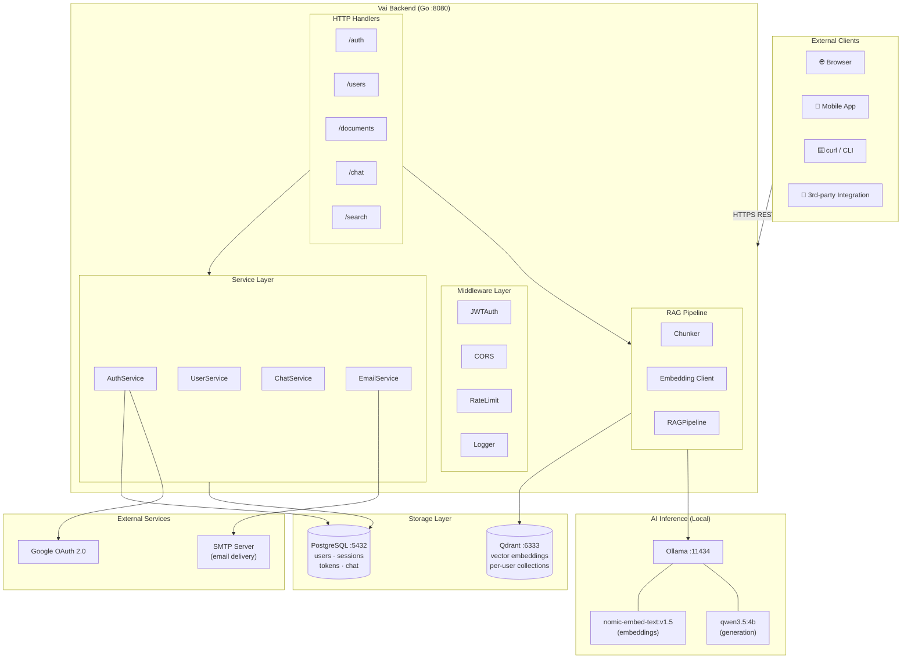
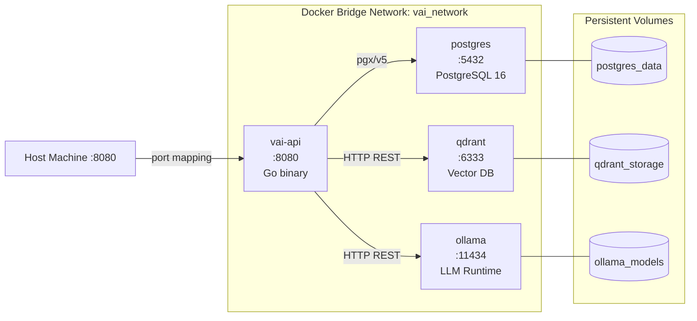
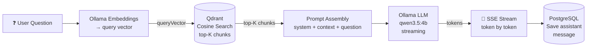
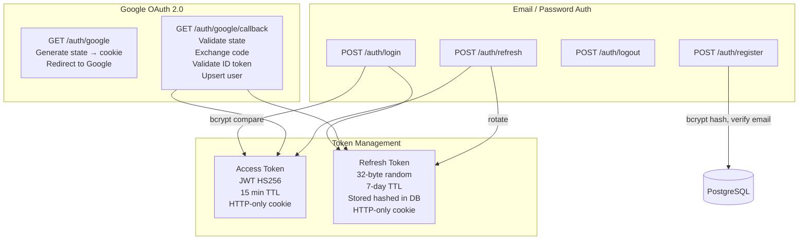
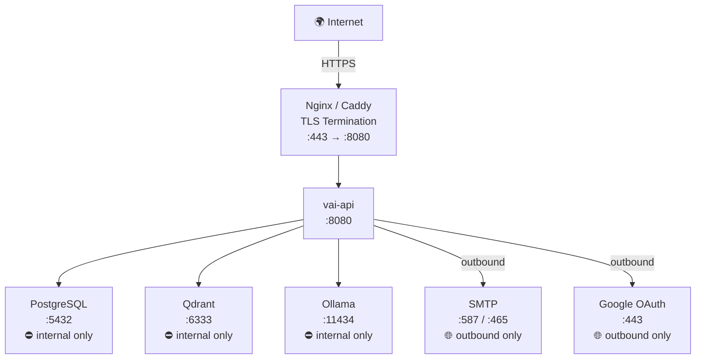
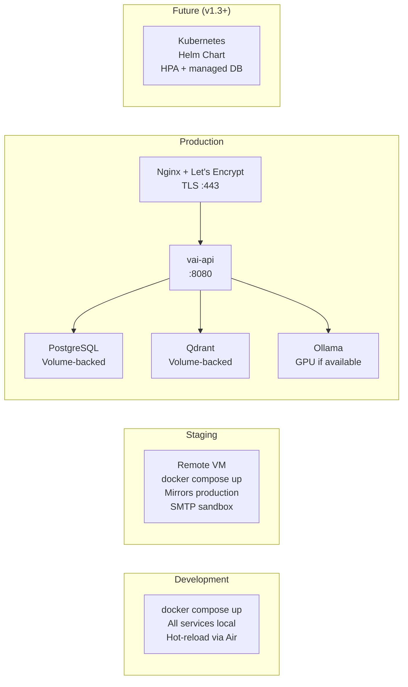

# Architecture Diagram
## Vai — Privacy-First AI Document Assistant

**Version:** 1.0  
**Date:** June 2025

---

## System Architecture Overview



---

## Docker Compose Service Topology



---

## Data Flow — Document Ingestion

```mermaid
flowchart LR
    File["📄 Text File\n(multipart upload)"]
    Chunker["Chunker\n500-char chunks\n100-char overlap"]
    Embed["Ollama Embeddings\nnomic-embed-text:v1.5\n→ 768-dim vector"]
    Qdrant[("Qdrant\nUpsert vectors\n+ payload")]
    PG[("PostgreSQL\nInsert document\nmetadata")]
    Response["✅ Response\n{document_id, chunks}"]

    File --> Chunker
    Chunker -->|[]Chunk| Embed
    Embed -->|[]float32 per chunk| Qdrant
    Qdrant --> PG
    PG --> Response
```

---

## Data Flow — Chat Query (Streaming)



---

## Authentication Architecture



---

## Network & Port Map



---

## Deployment Environments


