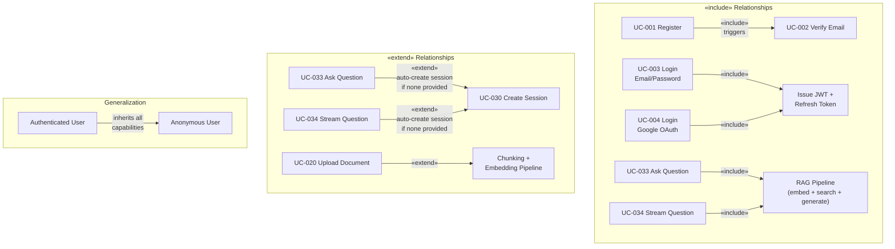

# Use Case Diagram
## Vai — Actor Interactions & System Use Cases

**Version:** 1.0  
**Date:** June 2025

---

## Actors

| Actor | Type | Description |
|-------|------|-------------|
| **Anonymous User** | Primary External | Can register, initiate OAuth, verify email, reset password |
| **Authenticated User** | Primary External | Full system access: documents, chat, profile management |
| **System Scheduler** | Internal | Automated cleanup jobs (expired tokens, orphaned collections) |
| **Google OAuth** | External System | Provides identity tokens in OAuth flow |
| **SMTP Server** | External System | Delivers transactional emails |
| **Ollama** | External System | Local AI inference — embeddings + generation |
| **Qdrant** | External System | Vector similarity search |

---

## Full Use Case Diagram

```mermaid
graph TB
    subgraph Actors_Left["External Actors"]
        AnonUser["👤 Anonymous User"]
        AuthUser["👤 Authenticated User\n(extends Anonymous)"]
        Scheduler["⚙️ System Scheduler"]
    end

    subgraph System["VAI SYSTEM"]
        subgraph Auth_UC["Authentication Use Cases"]
            UC001["UC-001\nRegister Account"]
            UC002["UC-002\nVerify Email"]
            UC003["UC-003\nLogin Email/Password"]
            UC004["UC-004\nLogin with Google"]
            UC005["UC-005\nLogout"]
            UC006["UC-006\nRefresh Access Token"]
            UC007["UC-007\nRequest Password Reset"]
            UC008["UC-008\nReset Password"]
        end

        subgraph Profile_UC["Profile Use Cases"]
            UC010["UC-010\nView Profile"]
            UC011["UC-011\nUpdate Profile"]
            UC012["UC-012\nDelete Account"]
        end

        subgraph Doc_UC["Document Use Cases"]
            UC020["UC-020\nUpload Document"]
            UC021["UC-021\nList Documents"]
            UC022["UC-022\nGet Document Metadata"]
            UC023["UC-023\nDelete Document"]
        end

        subgraph Chat_UC["Chat Use Cases"]
            UC030["UC-030\nCreate Chat Session"]
            UC031["UC-031\nList Chat Sessions"]
            UC032["UC-032\nView Session History"]
            UC033["UC-033\nAsk Question (Sync)"]
            UC034["UC-034\nAsk Question (Stream)"]
            UC035["UC-035\nDelete Chat Session"]
            UC036["UC-036\nDebug Chunk Search"]
        end

        subgraph System_UC["System Use Cases"]
            UC040["UC-040\nPurge Expired Tokens"]
            UC041["UC-041\nCleanup Orphaned Collections"]
        end
    end

    subgraph External["External Systems"]
        Google["🔵 Google OAuth"]
        SMTP["📧 SMTP Server"]
        OL["🤖 Ollama"]
        QD["🗄️ Qdrant"]
    end

    AnonUser --> UC001
    AnonUser --> UC002
    AnonUser --> UC003
    AnonUser --> UC004
    AnonUser --> UC007
    AnonUser --> UC008

    AuthUser --> UC005
    AuthUser --> UC006
    AuthUser --> UC010
    AuthUser --> UC011
    AuthUser --> UC012
    AuthUser --> UC020
    AuthUser --> UC021
    AuthUser --> UC022
    AuthUser --> UC023
    AuthUser --> UC030
    AuthUser --> UC031
    AuthUser --> UC032
    AuthUser --> UC033
    AuthUser --> UC034
    AuthUser --> UC035
    AuthUser --> UC036

    Scheduler --> UC040
    Scheduler --> UC041

    UC004 --> Google
    UC001 -->|"sends email"| SMTP
    UC007 -->|"sends email"| SMTP
    UC020 -->|"embeddings"| OL
    UC033 -->|"embeddings + generation"| OL
    UC034 -->|"embeddings + streaming"| OL
    UC020 -->|"store vectors"| QD
    UC033 -->|"vector search"| QD
    UC034 -->|"vector search"| QD
    UC036 -->|"vector search"| QD
```

---

## Use Case Relationships

---

## Anonymous User Use Cases

### UC-001: Register Account

| Field | Detail |
|-------|--------|
| **Actor** | Anonymous User |
| **Preconditions** | Email not already registered |
| **Trigger** | User submits registration form |
| **Main Flow** | 1. Submit email + password + display_name → 2. Validate input → 3. Hash password (bcrypt) → 4. Store user (unverified) → 5. Generate HMAC token → 6. Send verification email |
| **Postconditions** | Account created with `is_verified=false`. Verification email sent. |
| **Exceptions** | E1: Email already registered → 409. E2: Weak password → 422. |

### UC-002: Verify Email

| Field | Detail |
|-------|--------|
| **Actor** | Anonymous User |
| **Preconditions** | Verification email received; token not expired (24h) or used |
| **Trigger** | User clicks verification link |
| **Main Flow** | 1. GET /auth/verify?token=... → 2. Validate HMAC signature → 3. Check token in DB (not used, not expired) → 4. Set `is_verified=true` → 5. Mark token used |
| **Postconditions** | User can now upload documents |
| **Exceptions** | E1: Token invalid → 401. E2: Token expired → 401. E3: Already used → 401. |

### UC-003: Login with Email/Password

| Field | Detail |
|-------|--------|
| **Actor** | Anonymous User |
| **Preconditions** | Account exists |
| **Main Flow** | 1. Submit credentials → 2. bcrypt compare → 3. Issue JWT (15min) + refresh token (7d) → 4. Set HTTP-only cookies |
| **Postconditions** | User authenticated; JWT cookie set |
| **Exceptions** | E1: Wrong credentials → 401 (generic, no email enumeration) |

### UC-004: Login with Google

| Field | Detail |
|-------|--------|
| **Actor** | Anonymous User |
| **Main Flow** | 1. GET /auth/google → 2. Generate + store state → 3. Redirect to Google → 4. User consents → 5. Callback with code → 6. Validate state → 7. Exchange code → 8. Validate ID token → 9. Upsert user → 10. Issue JWT |
| **Postconditions** | User authenticated; new account created if first time |

### UC-005–UC-008: (see Activity Diagrams)

---

## Authenticated User Use Cases

### UC-020: Upload Document

| Field | Detail |
|-------|--------|
| **Actor** | Authenticated User |
| **Preconditions** | User `is_verified=true` |
| **Main Flow** | 1. POST file → 2. Validate → 3. Chunk text → 4. Embed each chunk → 5. Upsert to Qdrant → 6. Save metadata to PostgreSQL |
| **Postconditions** | Document queryable via chat and search |
| **Exceptions** | E1: Not verified → 403. E2: File too large → 413. E3: Unsupported type → 422. |

### UC-033: Ask Question (Synchronous)

| Field | Detail |
|-------|--------|
| **Actor** | Authenticated User |
| **Main Flow** | 1. POST question → 2. Embed question → 3. Vector search Qdrant → 4. Build context prompt → 5. LLM generates answer → 6. Save to chat history → 7. Return full answer |
| **Postconditions** | Answer saved to session. Session created if none provided. |

### UC-034: Ask Question (Streaming)

| Field | Detail |
|-------|--------|
| **Actor** | Authenticated User |
| **Main Flow** | Same as UC-033 but response streamed token-by-token via SSE |
| **Postconditions** | Full assembled response saved to chat history after stream completes |

### UC-036: Debug Chunk Search

| Field | Detail |
|-------|--------|
| **Actor** | Authenticated User |
| **Purpose** | Developer/debug tool to inspect retrieval quality |
| **Main Flow** | 1. POST query → 2. Embed query → 3. Search Qdrant → 4. Return top-K chunks with scores (no LLM call) |

---

## System Use Cases

### UC-040: Purge Expired Tokens

| Field | Detail |
|-------|--------|
| **Actor** | System Scheduler |
| **Trigger** | Scheduled cron job (daily at 02:00) |
| **Action** | `DELETE FROM verification_tokens WHERE expires_at < NOW()` · `DELETE FROM password_reset_tokens WHERE expires_at < NOW()` · `DELETE FROM refresh_tokens WHERE expires_at < NOW() OR revoked = TRUE` |
| **Purpose** | Keep DB clean; prevent index bloat |

### UC-041: Cleanup Orphaned Qdrant Collections

| Field | Detail |
|-------|--------|
| **Actor** | System Scheduler |
| **Trigger** | Scheduled weekly |
| **Action** | List Qdrant collections → compare against users in DB → delete collections with no matching user |
| **Purpose** | Handle cases where user deletion cascaded in DB but Qdrant call failed |
