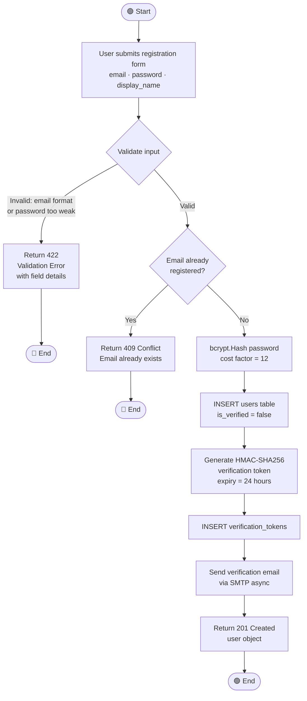
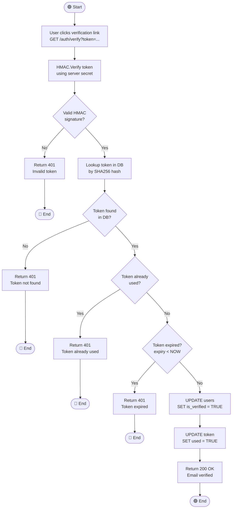
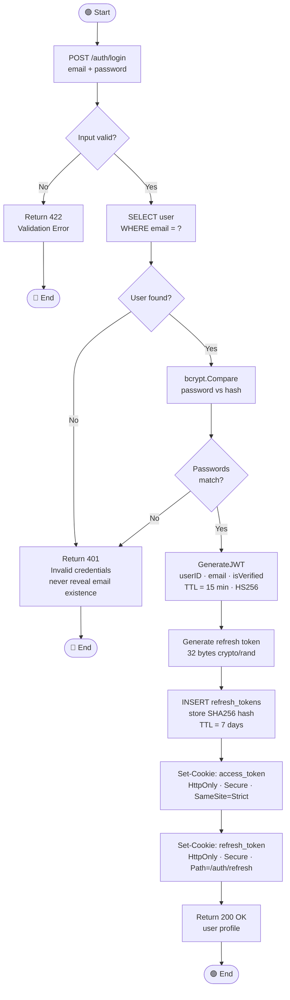
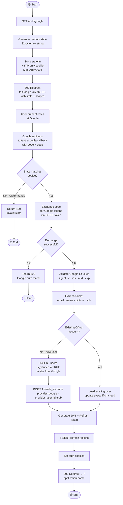
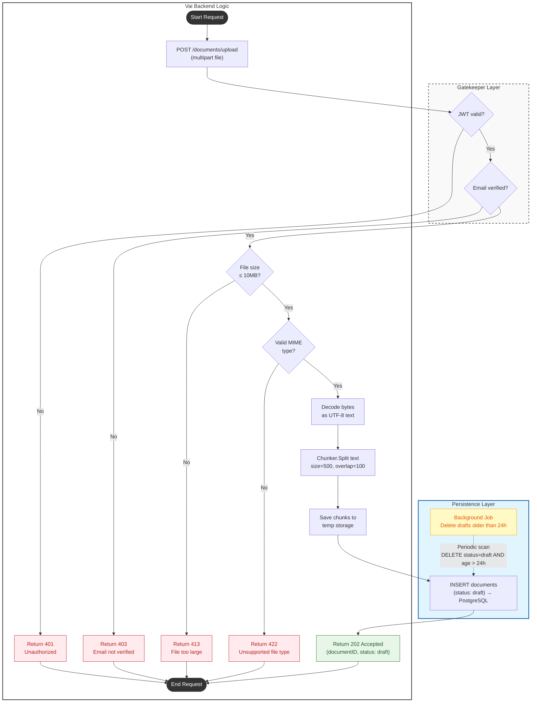
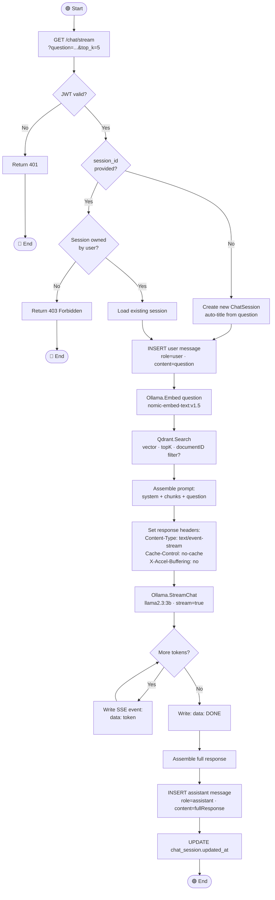
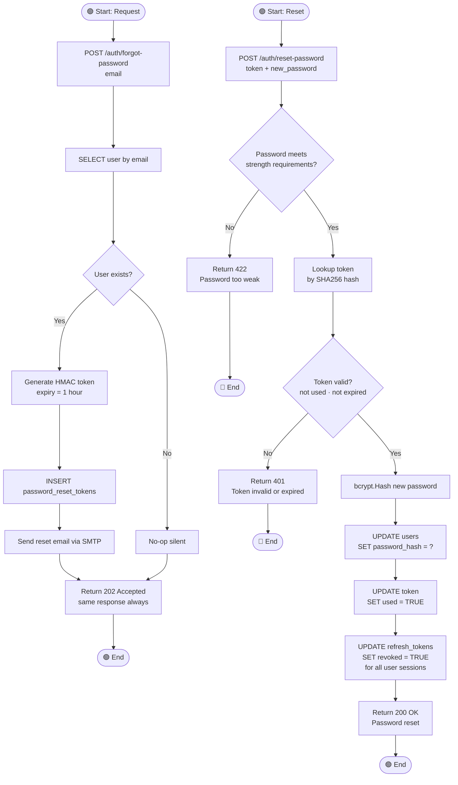
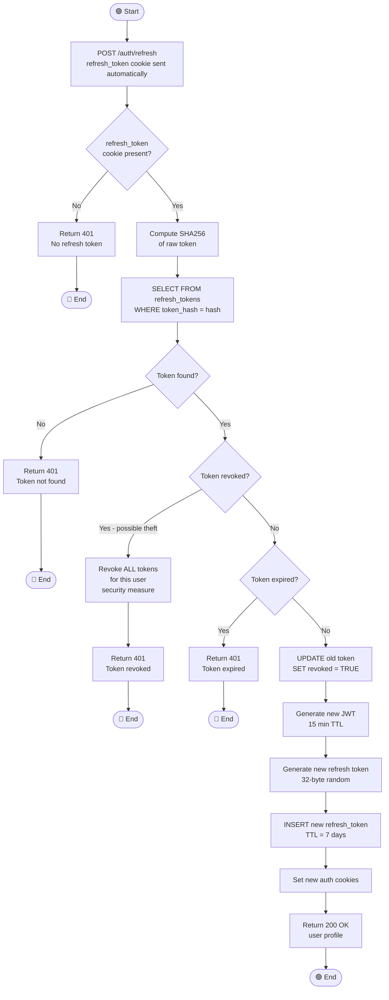

# Activity Diagrams

## Vai — Process Workflows

**Version:** 1.0  
**Date:** June 2025

---

## AD-01: User Registration



---

## AD-02: Email Verification



---

## AD-03: Email + Password Login



---

## AD-04: Google OAuth Login



---

## AD-05: Document Upload & Ingestion



---

## AD-06: Chat Query (Streaming)



---

## AD-07: Password Reset



---

## AD-08: Account Deletion

```mermaid
flowchart TD
    Start([🟢 Start]) --> A[DELETE /users/me]
    A --> B{JWT valid?}
    B -->|No| C[Return 401]
    C --> End1([🔴 End])

    B -->|Yes| D["Delete Qdrant collection\nuser_{userID}\nremoves all vectors"]
    D --> E{Qdrant delete\nsuccessful?}
    E -->|No - log error| F[Log error, continue]
    E -->|Yes| G2[DELETE FROM users WHERE id = userID]
    F --> G2
    G2 --> H[PostgreSQL CASCADE deletes documents, sessions, tokens, etc.]
    H --> I[Clear auth cookies (Set-Cookie: Max-Age=0)]

    I --> J[Return 204 No Content]
    J --> End2([🟢 End])
```

---

## AD-09: Token Refresh


