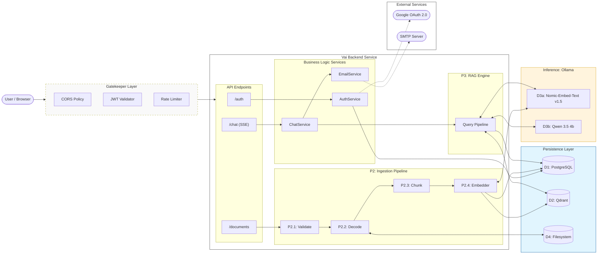
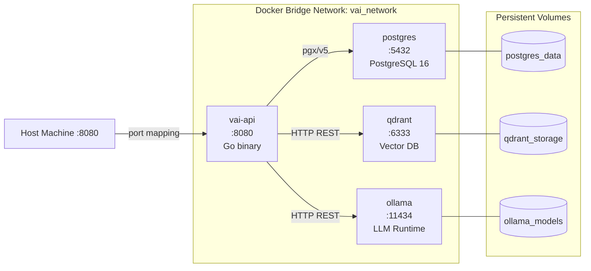
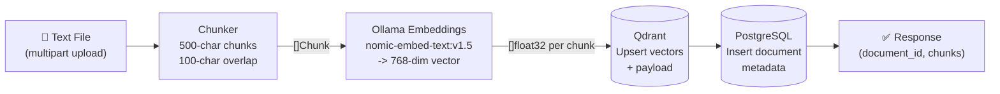
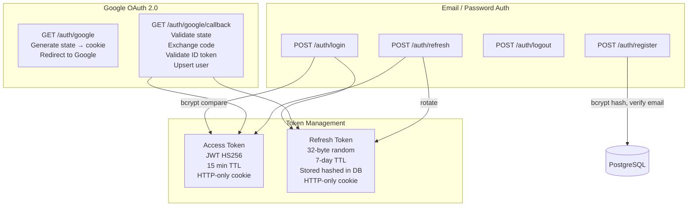
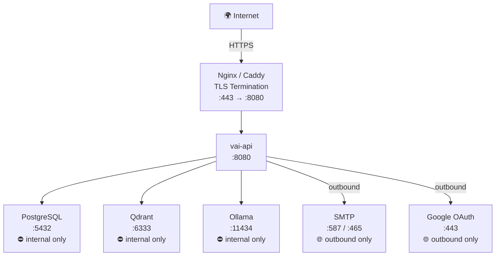
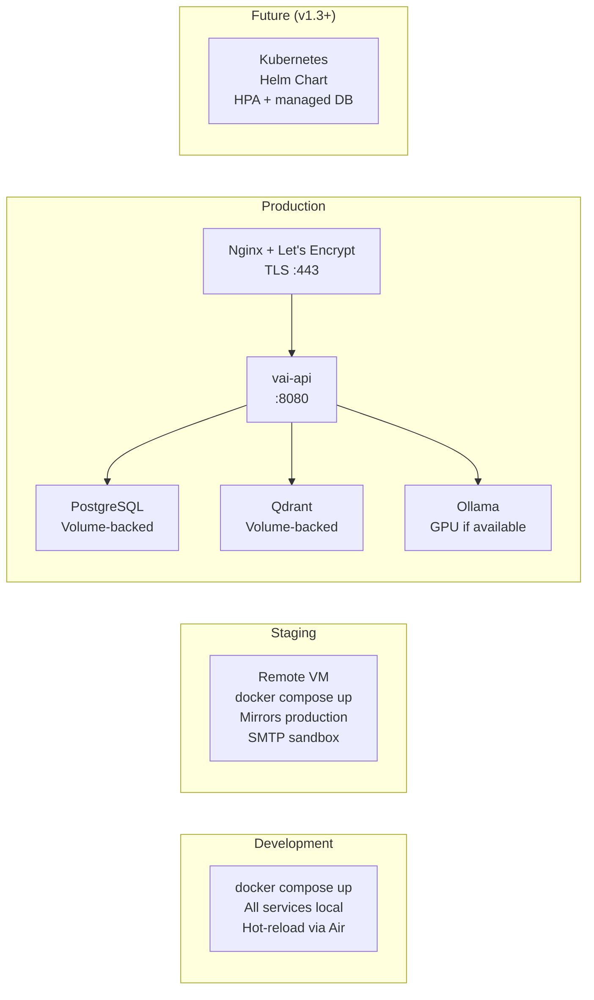

# Architecture Diagram

## Vai — Privacy-First AI Document Assistant

**Version:** 1.0  
**Date:** June 2025

---

## System Architecture Overview

---

## Docker Compose Service Topology

---

## Data Flow — Document Ingestion

---

## Data Flow — Chat Query (Streaming)

---

## Authentication Architecture

---

## Network & Port Map

---

## Deployment Environments

