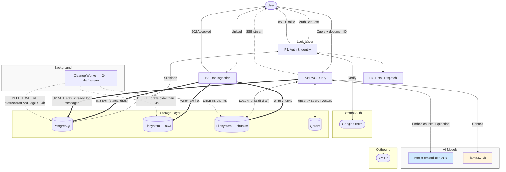
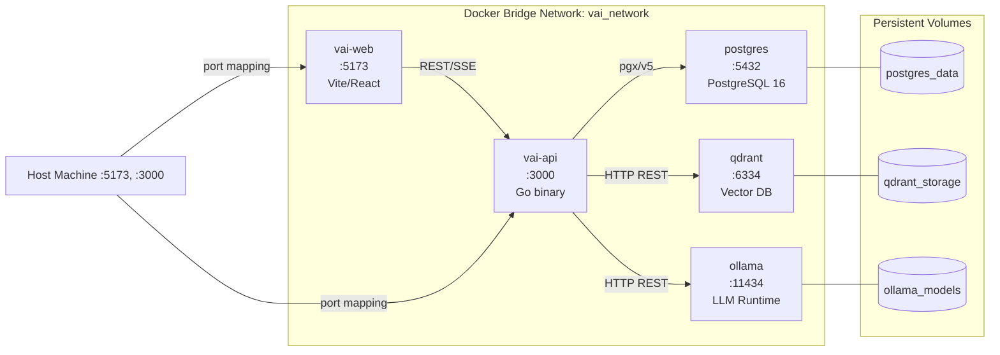
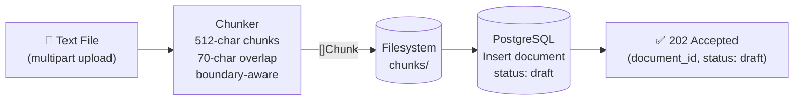
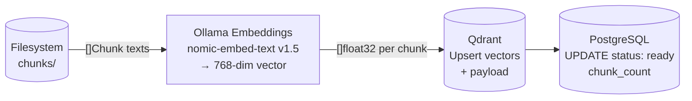
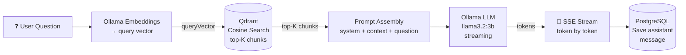
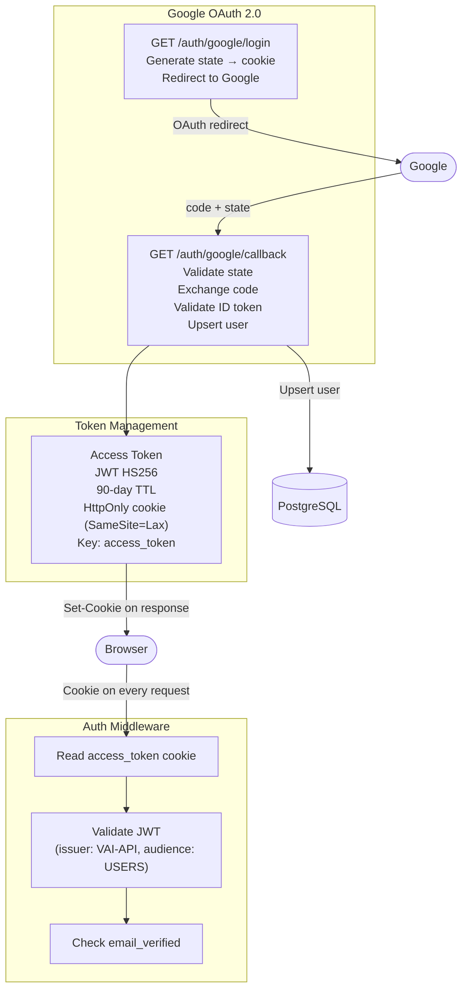
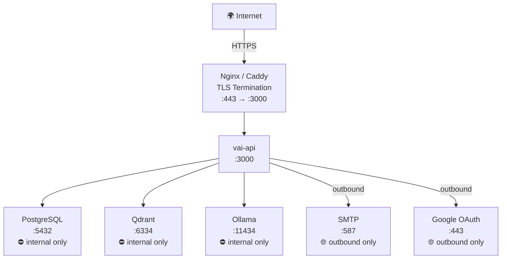
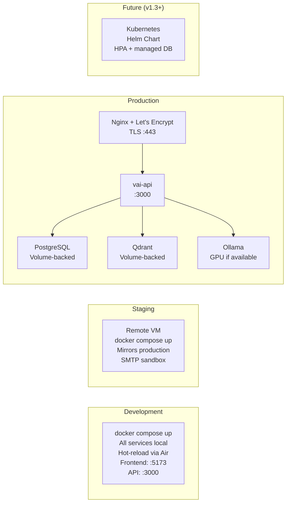

# Architecture

## Vai — Privacy-First AI Document Assistant

**Version:** 1.0
**Date:** April 2026

---

## System Architecture Overview

---

## Docker Compose Service Topology

---

## Data Flow — Document Ingestion

Embedding is **deferred** — it does not happen at upload time. The upload endpoint only validates, chunks, and stores the document as `draft`. Embedding runs lazily on the first query.

---

## Data Flow — Deferred Embedding (First Query Only)

Runs automatically inside the RAG engine when a document's status is still `draft`.

---

## Data Flow — Chat Query (Streaming)

---

## Authentication Architecture

Vai uses **Google OAuth 2.0** exclusively. There is no email/password registration. On successful OAuth callback, a signed JWT is issued and stored in an `HttpOnly` cookie. No refresh token — the JWT has a 90-day TTL and is read automatically from the cookie on every request.

---

## Network & Port Map

---

## Deployment Environments

