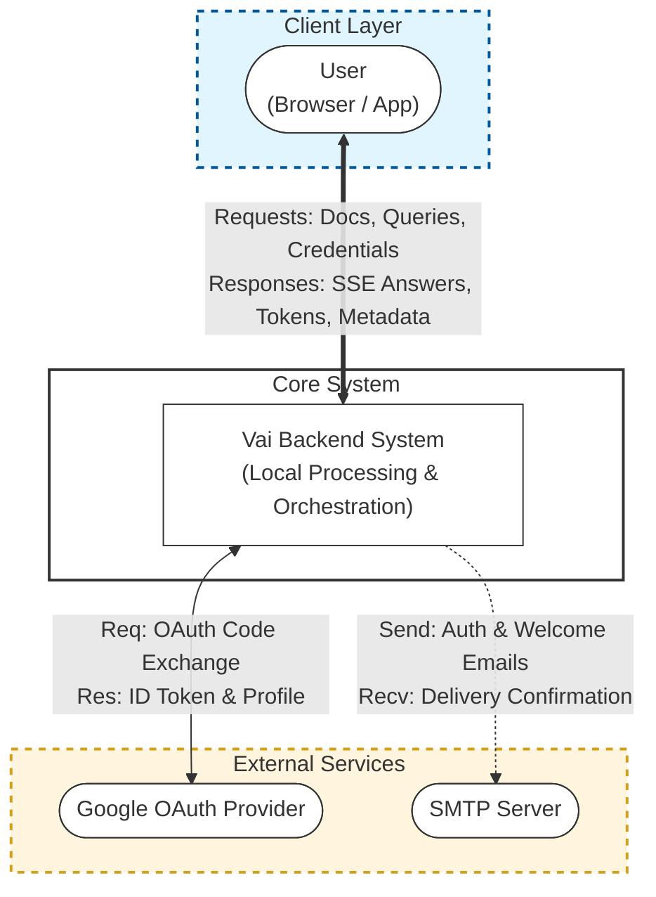
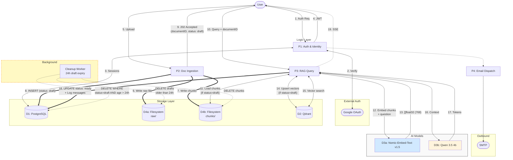
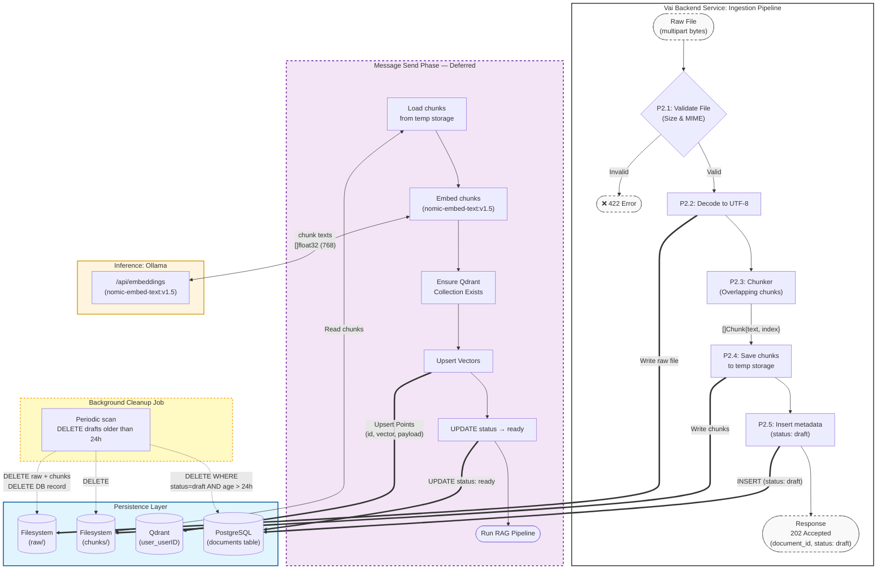
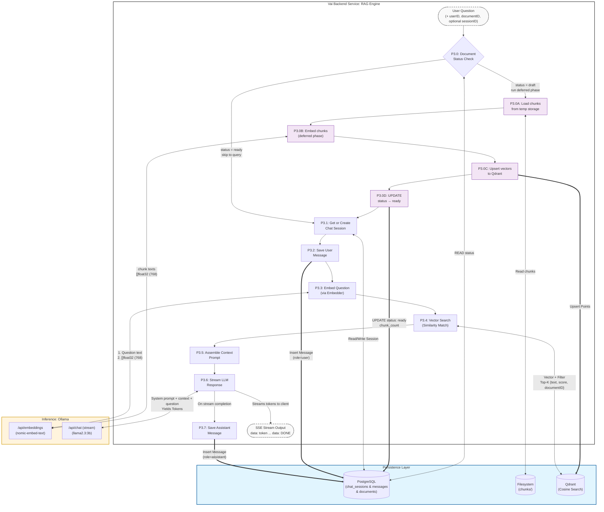

# Data Flow Diagram (DFD)

## Vai — How Data Moves Through the System

**Version:** 1.1  
**Date:** June 2025

---

## DFD Level 0 — Context Diagram

The system in its environment. Shows only external actors and the top-level process.

---

## DFD Level 1 — Main Processes

---

## DFD Level 2 — Document Ingestion & Message Send (P2 Expanded)

---

## DFD Level 2 — RAG Query (P3 Expanded)

---

## DFD Level 2 — Authentication (P1 Expanded)

---

## Data Stores Summary

| Store                | ID  | Read By                            | Written By                                         | Purpose                                                                            |
| -------------------- | --- | ---------------------------------- | -------------------------------------------------- | ---------------------------------------------------------------------------------- |
| PostgreSQL           | D1  | All services                       | AuthService, ChatService, UserService, RAGPipeline | Relational/transactional data including document status lifecycle                  |
| Qdrant               | D2  | RAGPipeline (P3)                   | RAGPipeline deferred phase (P3.0C)                 | Vector similarity search — only written on first message send, not on upload       |
| Filesystem raw/      | D4a | RAGPipeline worker                 | Upload handler (P2)                                | Permanent storage of original uploaded files                                       |
| Filesystem chunks/   | D4b | RAGPipeline deferred phase (P3.0A) | Upload handler (P2)                                | Temporary chunk storage for draft documents — deleted after embedding or after 24h |
| Cookie (client-side) | D5  | All requests                       | Auth handlers                                      | JWT access + refresh tokens                                                        |

---

## Data Stores — Document Status Lifecycle

| Status       | Set By                | Meaning                                     |
| ------------ | --------------------- | ------------------------------------------- |
| `draft`      | Upload handler (P2.5) | File saved, chunks stored, not yet embedded |
| `processing` | RAG engine (P3.0)     | Deferred embedding phase in progress        |
| `ready`      | RAG engine (P3.0D)    | Embedded and searchable in Qdrant           |
| `failed`     | RAG engine (P3.0)     | Embedding failed, eligible for retry        |

---

## Data Classification

| Data Element        | Classification | Storage                          | Retention                                                                   |
| ------------------- | -------------- | -------------------------------- | --------------------------------------------------------------------------- |
| User email          | PII            | PostgreSQL (plaintext)           | Until account deletion                                                      |
| Password hash       | Sensitive      | PostgreSQL                       | Until account deletion                                                      |
| OAuth tokens        | Sensitive      | PostgreSQL (encrypt recommended) | Until expired/revoked                                                       |
| Document text (raw) | Confidential   | Filesystem raw/                  | Until document deleted by user                                              |
| Document chunks     | Confidential   | Filesystem chunks/               | Until first message send (then deleted after embedding) or 24h draft expiry |
| Vector embeddings   | Confidential   | Qdrant payloads                  | Until document deleted                                                      |
| Chat messages       | Confidential   | PostgreSQL                       | Until session/account deleted                                               |
| JWT claims          | Internal       | HTTP cookie (signed)             | 15-minute TTL                                                               |
| Refresh tokens      | Sensitive      | PostgreSQL (hashed)              | 7-day TTL or revocation                                                     |
