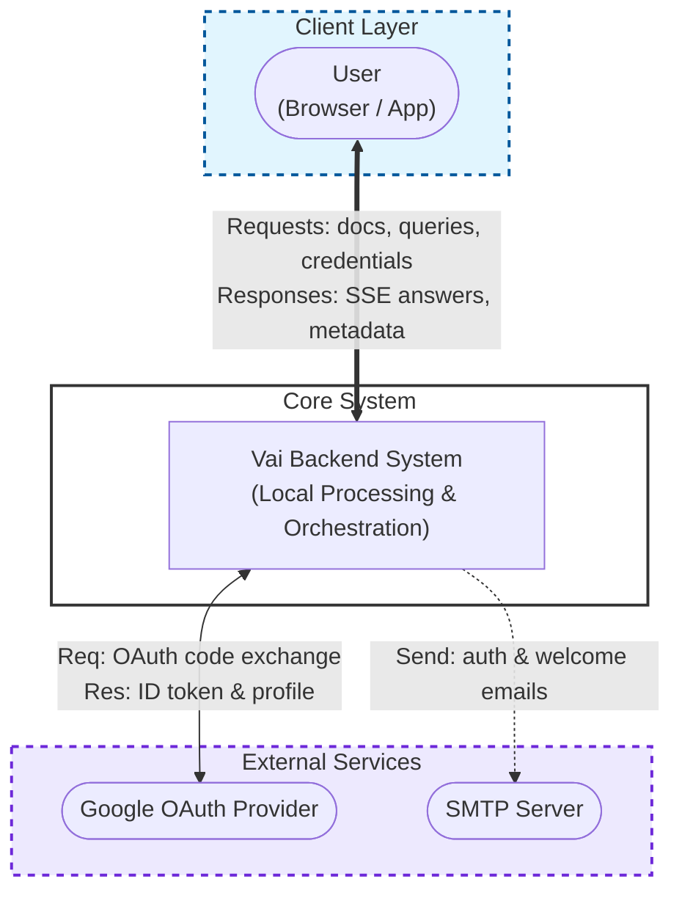
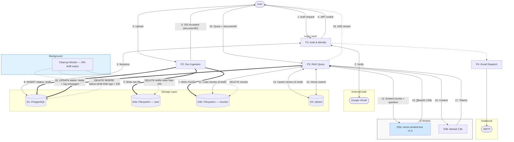
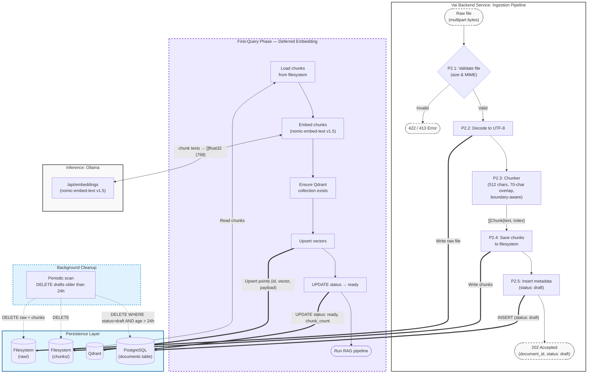
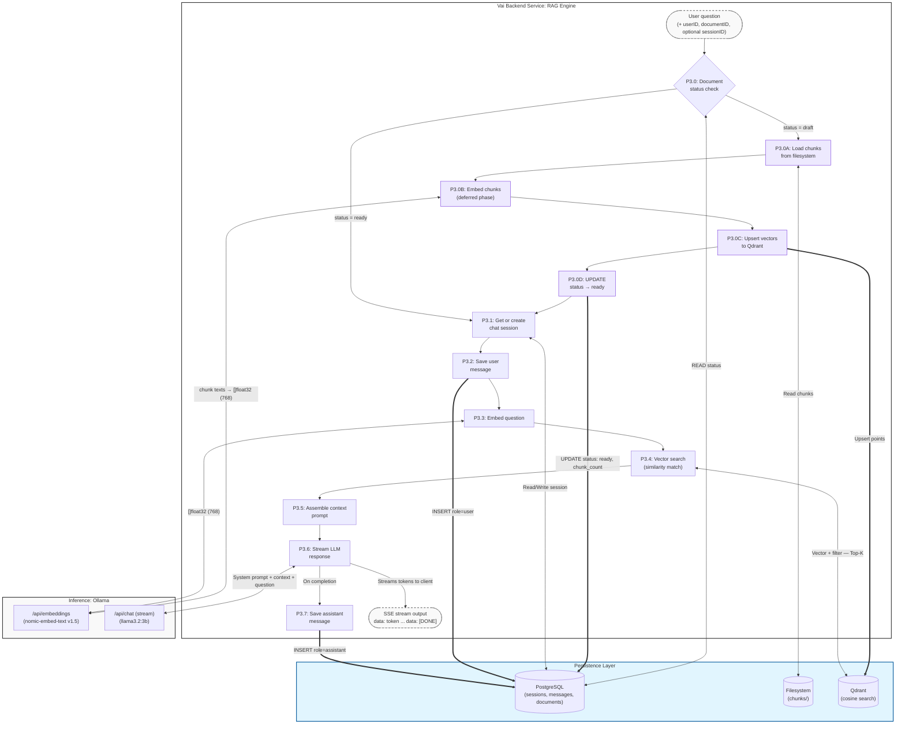
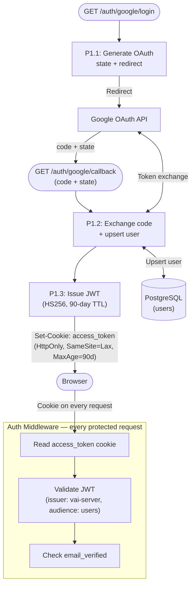

# Data Flow Diagram (DFD)

## Vai — How Data Moves Through the System

**Version:** 1.2
**Date:** April 2026

---

## DFD Level 0 — Context Diagram

The system in its environment. Shows only external actors and the top-level process.

---

## DFD Level 1 — Main Processes

---

## DFD Level 2 — Document Ingestion (P2 Expanded)

Embedding is **not** performed at upload time. The upload handler only validates, chunks, and stores the document as `draft`. Embedding runs lazily on the first query.

---

## DFD Level 2 — RAG Query (P3 Expanded)

---

## DFD Level 2 — Authentication (P1 Expanded)

Vai uses **Google OAuth 2.0 exclusively**. There is no email/password registration, no refresh token, and no password reset flow. On successful OAuth callback, a signed JWT is issued and stored in an `HttpOnly` cookie. The cookie is read automatically on every subsequent request — no `Authorization` header is needed.

---

## Data Stores Summary

| Store | ID | Read By | Written By | Purpose |
|---|---|---|---|---|
| PostgreSQL | D1 | All services | Auth, Chat, User, RAG pipeline | Relational data: users, documents, sessions, messages |
| Qdrant | D2 | RAG pipeline (P3) | RAG pipeline — deferred phase (P3.0C) | Vector similarity search — written on first query, not on upload |
| Filesystem raw/ | D4a | — | Upload handler (P2) | Original uploaded files |
| Filesystem chunks/ | D4b | RAG pipeline — deferred phase (P3.0A) | Upload handler (P2) | Chunk storage for draft documents — deleted after embedding or after 24h |
| Cookie (client-side) | D5 | All requests | Auth handler (P1) | JWT access token |

---

## Document Status Lifecycle

| Status | Set By | Meaning |
|---|---|---|
| `draft` | Upload handler (P2.5) | File saved, chunks stored, not yet embedded |
| `processing` | RAG engine (P3.0) | Deferred embedding phase in progress |
| `ready` | RAG engine (P3.0D) | Embedded and searchable in Qdrant |
| `failed` | RAG engine (P3.0) | Embedding failed, eligible for retry |

---

## Data Classification

| Data Element | Classification | Storage | Retention |
|---|---|---|---|
| User email | PII | PostgreSQL (plaintext) | Until account deletion |
| OAuth tokens | Sensitive | PostgreSQL | Until expired / revoked |
| Document text (raw) | Confidential | Filesystem raw/ | Until document deleted by user |
| Document chunks | Confidential | Filesystem chunks/ | Deleted after deferred embedding completes, or after 24h draft expiry |
| Vector embeddings | Confidential | Qdrant payloads | Until document deleted |
| Chat messages | Confidential | PostgreSQL | Until session / account deleted |
| JWT (access token) | Internal | HttpOnly cookie (signed, HS256) | 90-day TTL |