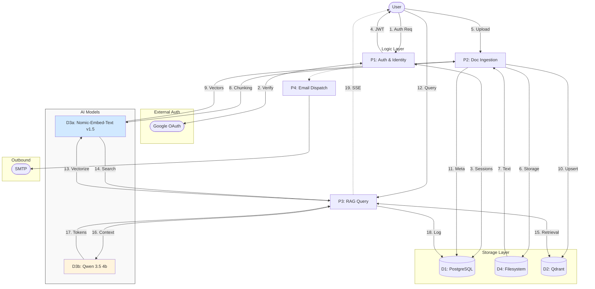
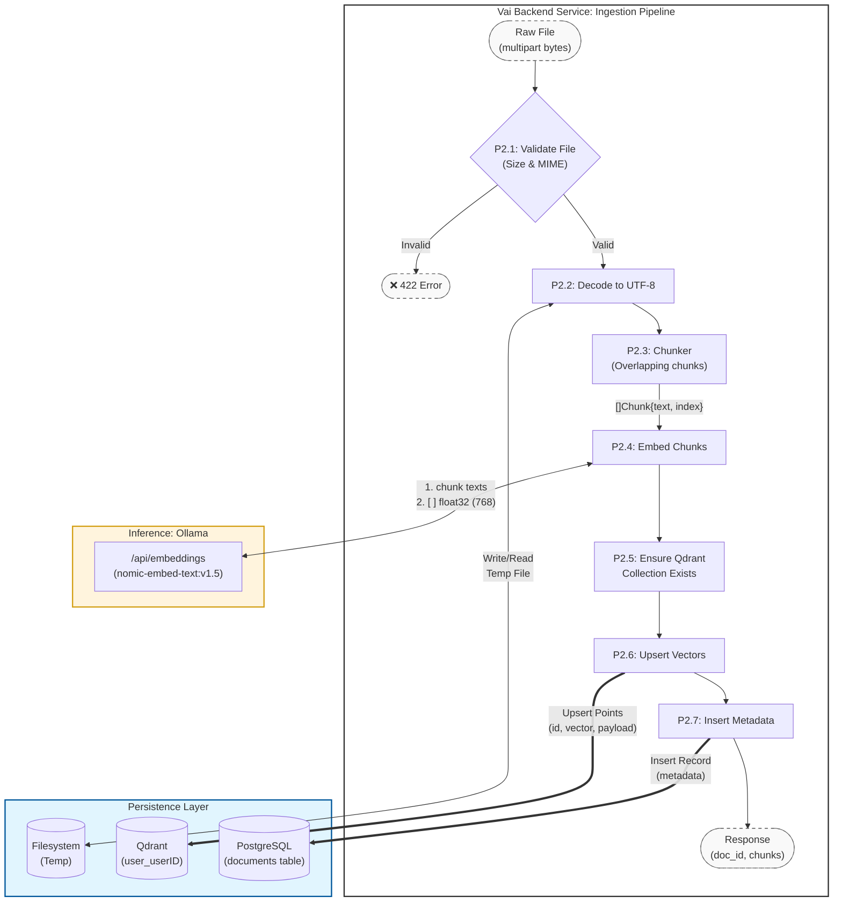
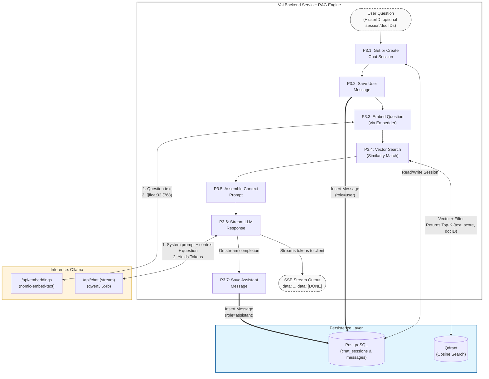
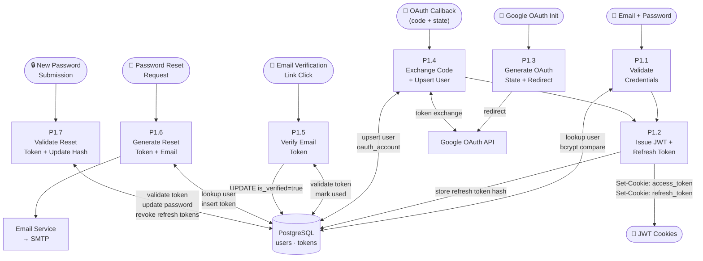

# Data Flow Diagram (DFD)
## Vai — How Data Moves Through the System

**Version:** 1.0  
**Date:** June 2025

---

## DFD Level 0 — Context Diagram

The system in its environment. Shows only external actors and the top-level process.

---

## DFD Level 1 — Main Processes

---

## DFD Level 2 — Document Ingestion (P2 Expanded)

---

## DFD Level 2 — RAG Query (P3 Expanded)

---

## DFD Level 2 — Authentication (P1 Expanded)

---

## Data Stores Summary

| Store | ID | Read By | Written By | Purpose |
|-------|----|---------|-----------|---------|
| PostgreSQL | D1 | All services | AuthService, ChatService, UserService, RAGPipeline | Relational/transactional data |
| Qdrant | D2 | RAGPipeline | RAGPipeline | Vector similarity search |
| Filesystem (temp) | D4 | RAGPipeline | Upload handler | Temporary file storage during ingestion |
| Cookie (client-side) | D5 | All requests | Auth handlers | JWT access + refresh tokens |

## Data Classification

| Data Element | Classification | Storage | Retention |
|-------------|---------------|---------|-----------|
| User email | PII | PostgreSQL (plaintext) | Until account deletion |
| Password hash | Sensitive | PostgreSQL | Until account deletion |
| OAuth tokens | Sensitive | PostgreSQL (encrypt recommended) | Until expired/revoked |
| Document text | Confidential | Qdrant payloads + filesystem (temp) | Until document deleted |
| Chat messages | Confidential | PostgreSQL | Until session/account deleted |
| JWT claims | Internal | HTTP cookie (signed) | 15-minute TTL |
| Refresh tokens | Sensitive | PostgreSQL (hashed) | 7-day TTL or revocation |
