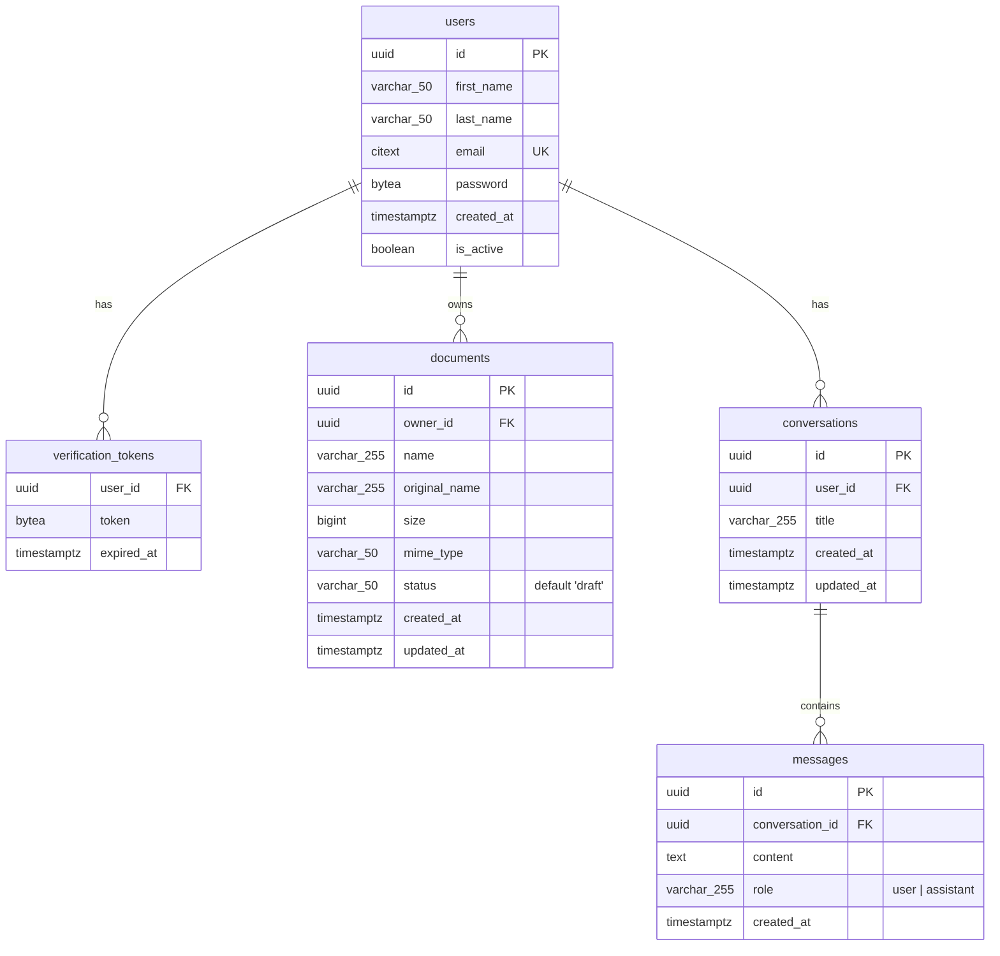

# Entity-Relationship Diagram (ERD)

## Vai — PostgreSQL Database Schema

**Version:** 1.0  
**Date:** April 2026  
**Database:** PostgreSQL 16

---

## Full ERD



---

## Table Definitions (SQL)

### users

```sql
CREATE TABLE IF NOT EXISTS users(
    id uuid primary key DEFAULT gen_random_uuid(),
    first_name VARCHAR(50) NOT NULL,
    last_name VARCHAR(50) NOT NULL,
    email citext UNIQUE NOT NULL,
    password bytea NOT NULL,
    created_at timestamp(0) WITH TIME ZONE NOT NULL DEFAULT NOW(),
    is_active BOOLEAN DEFAULT FALSE
);
```

### verification_tokens

```sql
CREATE TABLE IF NOT EXISTS verification_tokens(
    user_id uuid NOT NULL,
    token bytea NOT NULL,
    expired_at TIMESTAMPTZ NOT NULL,
    CONSTRAINT pk_user_verification_token FOREIGN KEY (user_id) REFERENCES users(id) ON DELETE CASCADE
);
```

### documents

```sql
CREATE TABLE IF NOT EXISTS documents(
    id UUID PRIMARY KEY DEFAULT gen_random_uuid(),
    owner_id UUID NOT NULL,
    name VARCHAR(255) NOT NULL,
    original_name VARCHAR(255) NOT NULL,
    size BIGINT NOT NULL,
    mime_type VARCHAR(50) NOT NULL,
    status VARCHAR(50) DEFAULT 'draft',
    created_at TIMESTAMPTZ DEFAULT Now(),
    updated_at TIMESTAMPTZ DEFAULT Now(),
    CONSTRAINT fk_user_documents FOREIGN KEY (owner_id) REFERENCES users(id) ON DELETE CASCADE
);
```

### conversations

```sql
CREATE TABLE IF NOT EXISTS conversations(
    id UUID PRIMARY KEY DEFAULT gen_random_uuid(),
    user_id UUID NOT NULL,
    title VARCHAR(255) NOT NULL,
    created_at TIMESTAMPTZ DEFAULT NOW(),
    updated_at TIMESTAMPTZ DEFAULT NOW(),
    CONSTRAINT fk_user_conversations FOREIGN KEY (user_id) REFERENCES users(id) ON DELETE CASCADE
);
```

### messages

```sql
CREATE TABLE IF NOT EXISTS messages(
    id UUID PRIMARY KEY DEFAULT gen_random_uuid(),
    conversation_id UUID NOT NULL,
    content TEXT NOT NULL,
    role VARCHAR(255) NOT NULL,
    created_at TIMESTAMPTZ DEFAULT NOW(),
    CONSTRAINT fk_conversation_messages FOREIGN KEY (conversation_id) REFERENCES conversations(id) ON DELETE CASCADE
);
```

---

## Qdrant Vector Schema

Qdrant is not a relational database — it stores **points** (vectors with payloads). Each user has one collection.

### Collection Naming

```
Collection name: documents
```

Isolation is achieved via **Payload Filtering** on the `owner_id` field.

### Point Structure

| Field                 | Type                   | Description                                                         |
| --------------------- | ---------------------- | ------------------------------------------------------------------- |
| `id`                  | UUID string            | Deterministic: `sha256(documentID + ":" + chunkIndex)[:16]` as UUID |
| `vector`              | `[]float32` (768 dims) | Embedding from `nomic-embed-text:v1.5`                              |
| `payload.owner_id`    | string (UUID)          | References `users.id` (Tenancy isolation)                           |
| `payload.document_id` | string (UUID)          | References `documents.id` in PostgreSQL                             |
| `payload.chunk_text`  | string                 | Raw text of this chunk                                              |
| `payload.chunk_index` | int                    | Zero-based position within the document                             |
| `payload.source`      | string                 | Original filename (optional)                                        |

### Collection Config

```json
{
  "vectors": {
    "size": 768,
    "distance": "Cosine"
  }
}
```

### Payload Indexes (for filtering)

```
CREATE PAYLOAD INDEX ON document_id (keyword)
```

This enables efficient filtering: `{ "must": [{ "key": "document_id", "match": { "value": "my-doc" } }] }`

---

## Entity Relationships Summary

| Relationship               | Type        | Cascade        |
| -------------------------- | ----------- | -------------- |
| `users` → `verification_tokens` | One-to-Many | DELETE CASCADE |
| `users` → `documents`      | One-to-Many | DELETE CASCADE |
| `users` → `conversations`   | One-to-Many | DELETE CASCADE |
| `conversations` → `messages` | One-to-Many | DELETE CASCADE |
