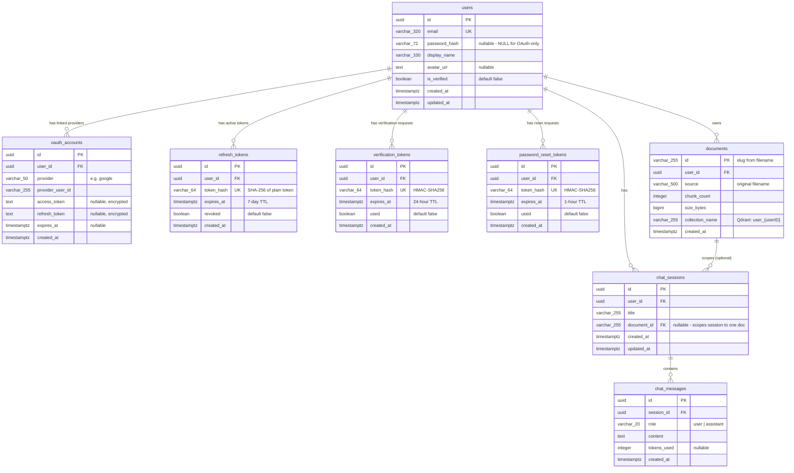

# Entity-Relationship Diagram (ERD)

## Vai — PostgreSQL Database Schema

**Version:** 1.0  
**Date:** June 2025  
**Database:** PostgreSQL 16

---

## Full ERD



---

## Table Definitions (SQL)

### users

```sql
CREATE TABLE users (
    id            UUID PRIMARY KEY DEFAULT gen_random_uuid(),
    email         VARCHAR(320) UNIQUE NOT NULL,
    password_hash VARCHAR(72),           -- NULL for OAuth-only accounts
    display_name  VARCHAR(100) NOT NULL,
    avatar_url    TEXT,
    is_verified   BOOLEAN NOT NULL DEFAULT FALSE,
    created_at    TIMESTAMPTZ NOT NULL DEFAULT NOW(),
    updated_at    TIMESTAMPTZ NOT NULL DEFAULT NOW()
);

CREATE INDEX idx_users_email ON users(email);
```

### oauth_accounts

```sql
CREATE TABLE oauth_accounts (
    id               UUID PRIMARY KEY DEFAULT gen_random_uuid(),
    user_id          UUID NOT NULL REFERENCES users(id) ON DELETE CASCADE,
    provider         VARCHAR(50) NOT NULL,
    provider_user_id VARCHAR(255) NOT NULL,
    access_token     TEXT,    -- encrypted at rest recommended
    refresh_token    TEXT,    -- encrypted at rest recommended
    expires_at       TIMESTAMPTZ,
    created_at       TIMESTAMPTZ NOT NULL DEFAULT NOW(),
    UNIQUE(provider, provider_user_id)
);

CREATE INDEX idx_oauth_accounts_user_id ON oauth_accounts(user_id);
```

### refresh_tokens

```sql
CREATE TABLE refresh_tokens (
    id         UUID PRIMARY KEY DEFAULT gen_random_uuid(),
    user_id    UUID NOT NULL REFERENCES users(id) ON DELETE CASCADE,
    token_hash VARCHAR(64) UNIQUE NOT NULL,  -- SHA-256 hex of plain token
    expires_at TIMESTAMPTZ NOT NULL,
    revoked    BOOLEAN NOT NULL DEFAULT FALSE,
    created_at TIMESTAMPTZ NOT NULL DEFAULT NOW()
);

CREATE INDEX idx_refresh_tokens_user_id ON refresh_tokens(user_id);
CREATE INDEX idx_refresh_tokens_hash ON refresh_tokens(token_hash);
-- Cleanup job: DELETE FROM refresh_tokens WHERE expires_at < NOW() OR revoked = TRUE;
```

### verification_tokens

```sql
CREATE TABLE verification_tokens (
    id         UUID PRIMARY KEY DEFAULT gen_random_uuid(),
    user_id    UUID NOT NULL REFERENCES users(id) ON DELETE CASCADE,
    token_hash VARCHAR(64) UNIQUE NOT NULL,
    expires_at TIMESTAMPTZ NOT NULL,  -- 24 hours from creation
    used       BOOLEAN NOT NULL DEFAULT FALSE,
    created_at TIMESTAMPTZ NOT NULL DEFAULT NOW()
);

CREATE INDEX idx_verification_tokens_user_id ON verification_tokens(user_id);
```

### password_reset_tokens

```sql
CREATE TABLE password_reset_tokens (
    id         UUID PRIMARY KEY DEFAULT gen_random_uuid(),
    user_id    UUID NOT NULL REFERENCES users(id) ON DELETE CASCADE,
    token_hash VARCHAR(64) UNIQUE NOT NULL,
    expires_at TIMESTAMPTZ NOT NULL,  -- 1 hour from creation
    used       BOOLEAN NOT NULL DEFAULT FALSE,
    created_at TIMESTAMPTZ NOT NULL DEFAULT NOW()
);

CREATE INDEX idx_password_reset_tokens_user_id ON password_reset_tokens(user_id);
```

### documents

```sql
CREATE TABLE documents (
    id              VARCHAR(255) PRIMARY KEY,  -- deterministic slug
    user_id         UUID NOT NULL REFERENCES users(id) ON DELETE CASCADE,
    source          VARCHAR(500) NOT NULL,
    chunk_count     INTEGER NOT NULL,
    size_bytes      BIGINT NOT NULL,
    collection_name VARCHAR(255) NOT NULL,     -- "user_<userID>"
    created_at      TIMESTAMPTZ NOT NULL DEFAULT NOW()
);

CREATE INDEX idx_documents_user_id ON documents(user_id);
```

### chat_sessions

```sql
CREATE TABLE chat_sessions (
    id          UUID PRIMARY KEY DEFAULT gen_random_uuid(),
    user_id     UUID NOT NULL REFERENCES users(id) ON DELETE CASCADE,
    title       VARCHAR(255) NOT NULL,
    document_id VARCHAR(255) REFERENCES documents(id) ON DELETE SET NULL,
    created_at  TIMESTAMPTZ NOT NULL DEFAULT NOW(),
    updated_at  TIMESTAMPTZ NOT NULL DEFAULT NOW()
);

CREATE INDEX idx_chat_sessions_user_id ON chat_sessions(user_id);
CREATE INDEX idx_chat_sessions_updated_at ON chat_sessions(user_id, updated_at DESC);
```

### chat_messages

```sql
CREATE TABLE chat_messages (
    id          UUID PRIMARY KEY DEFAULT gen_random_uuid(),
    session_id  UUID NOT NULL REFERENCES chat_sessions(id) ON DELETE CASCADE,
    role        VARCHAR(20) NOT NULL CHECK (role IN ('user', 'assistant')),
    content     TEXT NOT NULL,
    tokens_used INTEGER,
    created_at  TIMESTAMPTZ NOT NULL DEFAULT NOW()
);

CREATE INDEX idx_chat_messages_session_id ON chat_messages(session_id, created_at ASC);
```

---

## Qdrant Vector Schema

Qdrant is not a relational database — it stores **points** (vectors with payloads). Each user has one collection.

### Collection Naming

```
Collection name: user_{uuid}
Example:         user_550e8400-e29b-41d4-a716-446655440000
```

### Point Structure

| Field                 | Type                   | Description                                                         |
| --------------------- | ---------------------- | ------------------------------------------------------------------- |
| `id`                  | UUID string            | Deterministic: `sha256(documentID + ":" + chunkIndex)[:16]` as UUID |
| `vector`              | `[]float32` (768 dims) | Embedding from `nomic-embed-text:v1.5`                              |
| `payload.document_id` | string                 | References `documents.id` in PostgreSQL                             |
| `payload.chunk_text`  | string                 | Raw text of this chunk                                              |
| `payload.chunk_index` | int                    | Zero-based position within the document                             |
| `payload.source`      | string                 | Original filename                                                   |

### Collection Config

```json
{
  "vectors": {
    "size": 768,
    "distance": "Cosine"
  }
}
```

### Payload Indexes (for filtering)

```
CREATE PAYLOAD INDEX ON document_id (keyword)
```

This enables efficient filtering: `{ "must": [{ "key": "document_id", "match": { "value": "my-doc" } }] }`

---

## Entity Relationships Summary

| Relationship                      | Type                      | Cascade        |
| --------------------------------- | ------------------------- | -------------- |
| `users` → `oauth_accounts`        | One-to-Many               | DELETE CASCADE |
| `users` → `refresh_tokens`        | One-to-Many               | DELETE CASCADE |
| `users` → `verification_tokens`   | One-to-Many               | DELETE CASCADE |
| `users` → `password_reset_tokens` | One-to-Many               | DELETE CASCADE |
| `users` → `documents`             | One-to-Many               | DELETE CASCADE |
| `users` → `chat_sessions`         | One-to-Many               | DELETE CASCADE |
| `documents` → `chat_sessions`     | One-to-Many (optional FK) | SET NULL       |
| `chat_sessions` → `chat_messages` | One-to-Many               | DELETE CASCADE |
