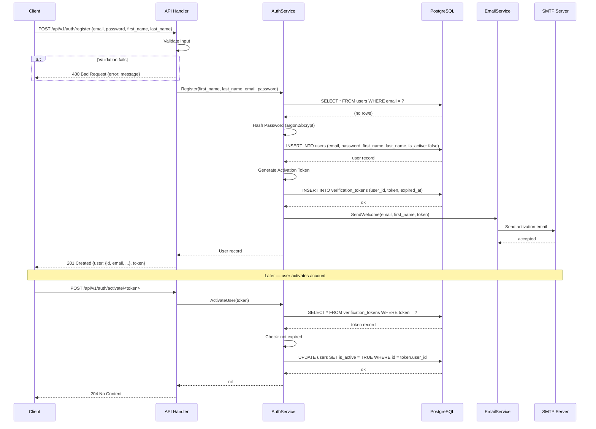
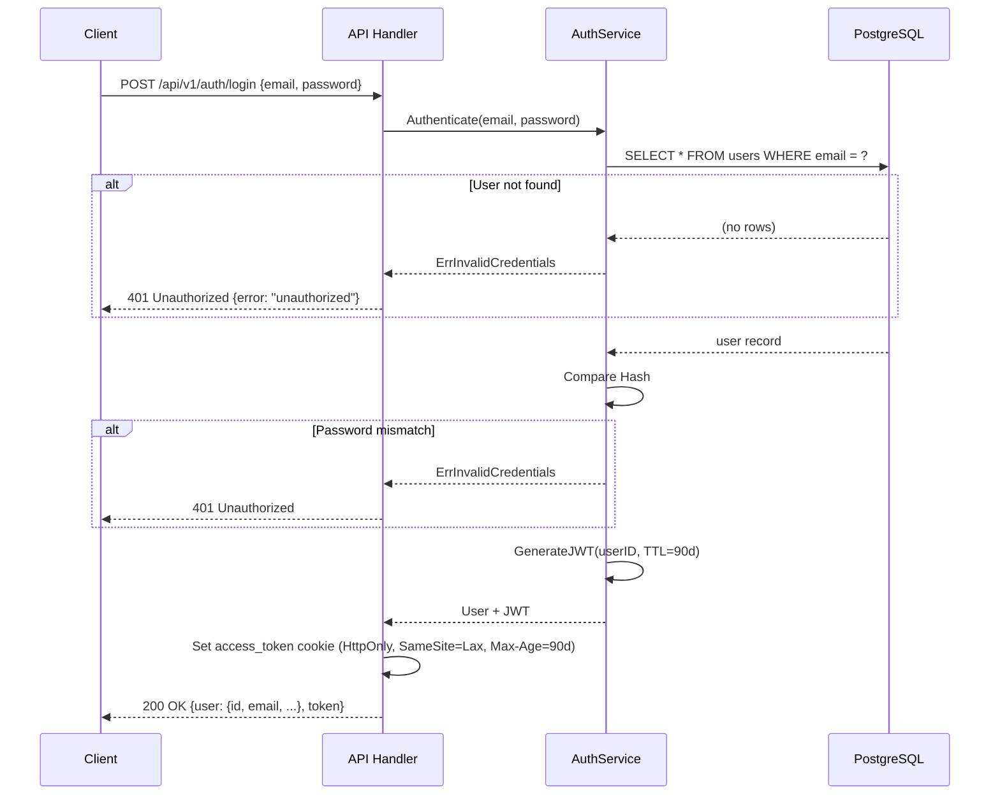
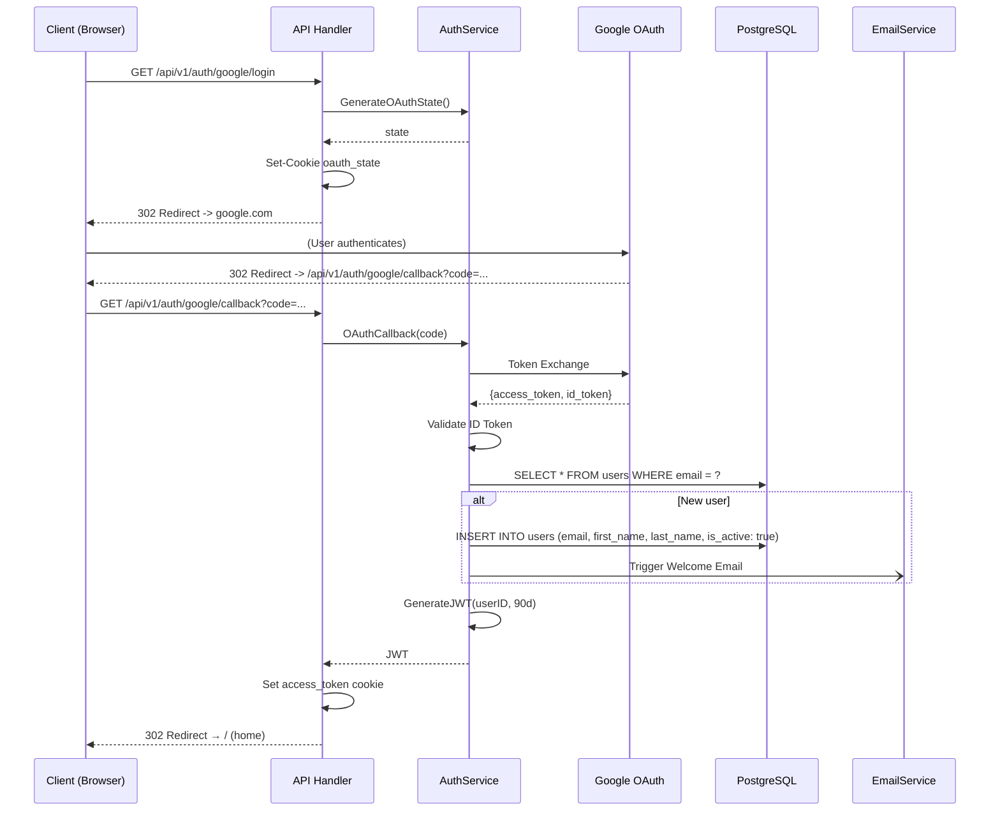
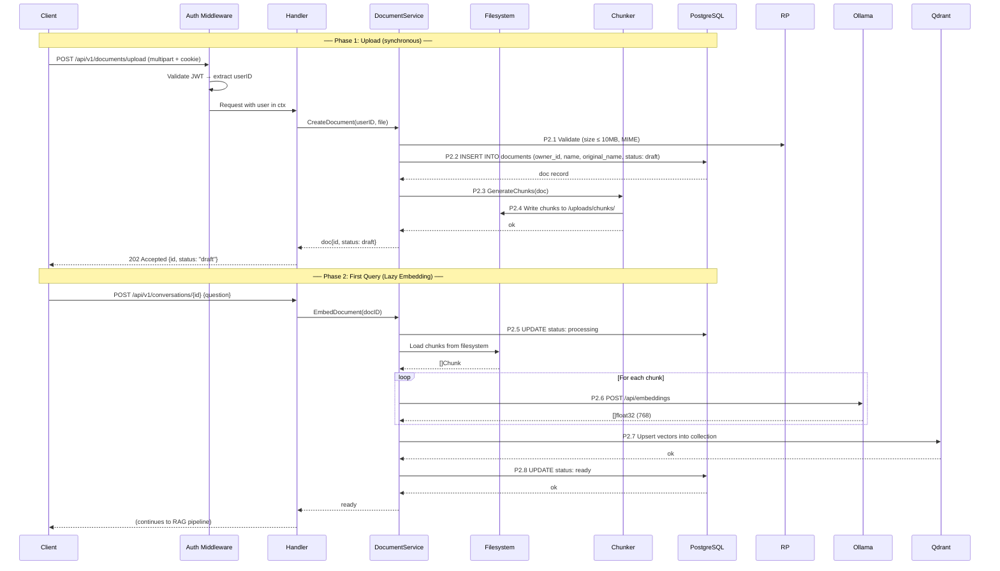
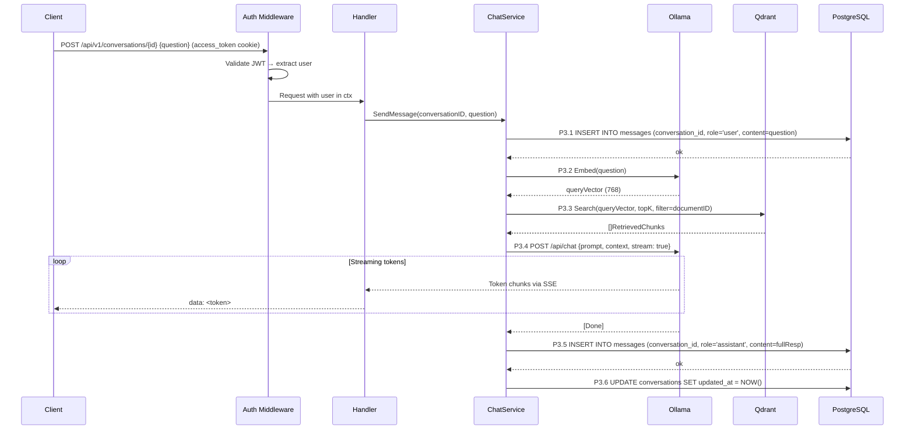
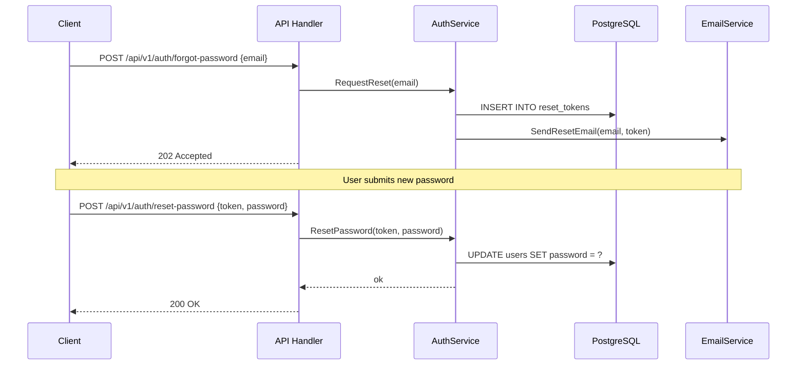
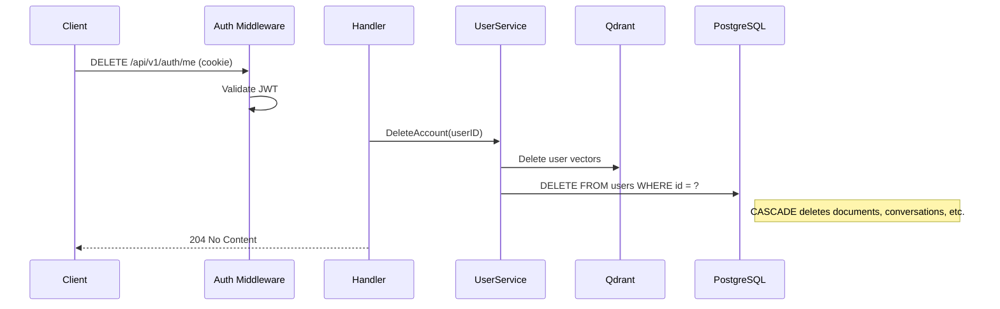

# Sequence Diagrams

## Vai — Component Interaction Over Time

**Version:** 1.0  
**Date:** April 2026

---

## SD-01: User Registration & Email Verification

---

## SD-02: Email + Password Login

---

## SD-04: Google OAuth 2.0 Flow (Planned)

---

## SD-05: Document Ingestion

---

## SD-06: Chat Query — Streaming Response

---

## SD-07: Password Reset Flow (Planned)

---

## SD-08: Account Deletion (Planned)

