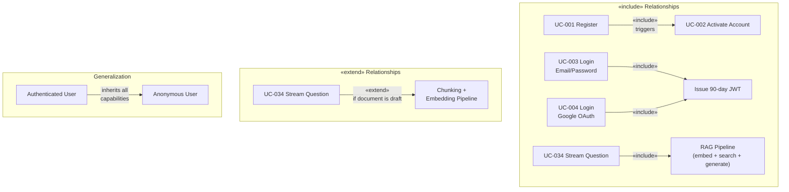

# Use Case Diagram
## Vai — Actor Interactions & System Use Cases

**Version:** 1.0  
**Date:** April 2026

---

## Actors

| Actor | Type | Description |
|-------|------|-------------|
| **Anonymous User** | Primary External | Can register, initiate OAuth, and activate account |
| **Authenticated User** | Primary External | Full system access: documents, conversations, profile |
| **System Scheduler** | Internal | Automated cleanup of stale document drafts (24h expiry) |
| **Google OAuth** | External System | Provides identity tokens for single sign-on |
| **SMTP Server** | External System | Delivers activation and transactional emails |
| **Ollama** | External System | Local AI inference — embeddings + generation |
| **Qdrant** | External System | Vector similarity search |

---

## Full Use Case Diagram

```mermaid
graph TB
    subgraph Actors_Left["External Actors"]
        AnonUser["👤 Anonymous User"]
        AuthUser["👤 Authenticated User\n(extends Anonymous)"]
        Scheduler["⚙️ System Scheduler"]
    end

    subgraph System["VAI SYSTEM"]
        subgraph Auth_UC["Authentication Use Cases"]
            UC001["UC-001\nRegister Account"]
            UC002["UC-002\nActivate Account"]
            UC003["UC-003\nLogin Email/Password"]
            UC004["UC-004\nLogin with Google"]
            UC005["UC-005\nLogout"]
            UC007["UC-007\nRequest Password Reset (Planned)"]
            UC008["UC-008\nReset Password (Planned)"]
        end

        subgraph Profile_UC["Profile Use Cases"]
            UC010["UC-010\nView Profile"]
            UC012["UC-012\nDelete Account (Planned)"]
        end

        subgraph Doc_UC["Document Use Cases"]
            UC020["UC-020\nUpload Document"]
            UC021["UC-021\nList Documents (Planned)"]
            UC023["UC-023\nDelete Document (Planned)"]
        end

        subgraph Chat_UC["Conversation Use Cases"]
            UC030["UC-030\nCreate Conversation"]
            UC031["UC-031\nList Conversations"]
            UC032["UC-032\nView Conversation History"]
            UC034["UC-034\nAsk Question (Stream)"]
            UC036["UC-036\nDebug Chunk Search (Planned)"]
        end

        subgraph System_UC["System Use Cases"]
            UC040["UC-040\nPurge Stale Drafts"]
        end
    end

    subgraph External["External Systems"]
        Google["🔵 Google OAuth"]
        SMTP["📧 SMTP Server"]
        OL["🤖 Ollama"]
        QD["🗄️ Qdrant"]
    end

    AnonUser --> UC001
    AnonUser --> UC002
    AnonUser --> UC003
    AnonUser --> UC004
    AnonUser --> UC007
    AnonUser --> UC008

    AuthUser --> UC005
    AuthUser --> UC010
    AuthUser --> UC012
    AuthUser --> UC020
    AuthUser --> UC021
    AuthUser --> UC023
    AuthUser --> UC030
    AuthUser --> UC031
    AuthUser --> UC032
    AuthUser --> UC034
    AuthUser --> UC036

    Scheduler --> UC040

    UC004 --> Google
    UC001 -->|"sends email"| SMTP
    UC007 -->|"sends email"| SMTP
    UC020 -->|"store raw file"| FS[(Filesystem)]
    UC034 -->|"lazy embedding"| OL
    UC034 -->|"lazy embedding"| QD
    UC034 -->|"vector search"| QD
    UC034 -->|"generation"| OL
```

---

## Use Case Relationships

---

## Anonymous User Use Cases

### UC-001: Register Account

| Field | Detail |
|-------|--------|
| **Actor** | Anonymous User |
| **Preconditions** | Email not already registered |
| **Trigger** | User submits registration form |
| **Main Flow** | 1. Submit first_name + last_name + email + password → 2. Validate input → 3. Hash password → 4. Store user (is_active: false) → 5. Generate activation token → 6. Send activation email |
| **Postconditions** | Account created with `is_active=false`. Email sent. |
| **Exceptions** | E1: Email already registered → 400 Conflict. E2: Weak password → 400 Bad Request. |

### UC-002: Activate Account

| Field | Detail |
|-------|--------|
| **Actor** | Anonymous User |
| **Preconditions** | Activation email received; token not expired |
| **Trigger** | User submits activation token |
| **Main Flow** | 1. POST /api/v1/auth/activate/{token} → 2. Validate token in DB → 3. Set `is_active=true` |
| **Postconditions** | User can now login and upload documents |
| **Exceptions** | E1: Token invalid/expired → 400/404. |

### UC-003: Login with Email/Password

| Field | Detail |
|-------|--------|
| **Actor** | Anonymous User |
| **Preconditions** | Account exists and is active |
| **Main Flow** | 1. Submit credentials → 2. Compare hash → 3. Issue 90-day JWT → 4. Set HTTP-only cookie |
| **Postconditions** | User authenticated; access_token cookie set |
| **Exceptions** | E1: Wrong credentials → 401 Unauthorized |

### UC-004: Login with Google

| Field | Detail |
|-------|--------|
| **Actor** | Anonymous User |
| **Main Flow** | 1. GET /auth/google → 2. Generate + store state → 3. Redirect to Google → 4. User consents → 5. Callback with code → 6. Validate state → 7. Exchange code → 8. Validate ID token → 9. Upsert user → 10. Issue JWT |
| **Postconditions** | User authenticated; new account created if first time |

### UC-005–UC-008: (see Activity Diagrams)

---

## Authenticated User Use Cases

### UC-020: Upload Document

| Field | Detail |
|-------|--------|
| **Actor** | Authenticated User |
| **Preconditions** | Account is active |
| **Main Flow** | 1. POST file → 2. Validate → 3. Store raw file → 4. Generate & store chunks in filesystem → 5. Save metadata to DB (status: draft) |
| **Postconditions** | Document stored as draft. Embedding deferred to first query. |
| **Exceptions** | E1: Not active → 403. E2: File too large → 400. |

### UC-033: Ask Question (Synchronous)

| Field | Detail |
|-------|--------|
| **Actor** | Authenticated User |
| **Main Flow** | 1. POST question → 2. Embed question → 3. Vector search Qdrant → 4. Build context prompt → 5. LLM generates answer → 6. Save to chat history → 7. Return full answer |
| **Postconditions** | Answer saved to session. Session created if none provided. |

### UC-034: Ask Question (Streaming)

| Field | Detail |
|-------|--------|
| **Actor** | Authenticated User |
| **Main Flow** | 1. POST question → 2. Check document status; if "draft", run chunk-embedding-upsert pipeline → 3. Embed question → 4. Vector search Qdrant → 5. Stream response via SSE |
| **Postconditions** | Response streamed. Conversation history updated locally after completion. |

### UC-036: Debug Chunk Search

| Field | Detail |
|-------|--------|
| **Actor** | Authenticated User |
| **Purpose** | Developer/debug tool to inspect retrieval quality |
| **Main Flow** | 1. POST query → 2. Embed query → 3. Search Qdrant → 4. Return top-K chunks with scores (no LLM call) |

---

## System Use Cases

### UC-040: Purge Stale Drafts

| Field | Detail |
|-------|--------|
| **Actor** | System Scheduler |
| **Trigger** | Scheduled job (e.g., every 24h) |
| **Action** | `DELETE FROM documents WHERE status = 'draft' AND created_at < NOW() - '24 hours'::interval` |
| **Purpose** | Clean up raw files and chunks for documents that were never queried/embedded |
